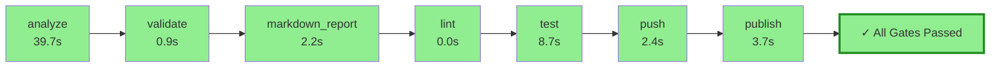

# Pyqual Pipeline Report

**Generated:** 2026-04-01 15:53:53
**Pipeline run:** 2026-04-01T13:53:51.218349+00:00

---

## 🔄 Pipeline Flow Diagram



## 📈 ASCII Visualization

```
┌─────────────────────────────────────────────────────────────────┐
│                    PYQUAL PIPELINE FLOW                         │
├─────────────────────────────────────────────────────────────────┤
│  ✓ analyze                     39.7s 🟢        │
│  ✓ validate                     0.9s 🟢        │
│  ✓ markdown_report              2.2s 🟢        │
│  ✓ lint                         0.0s 🟢        │
│  ✓ test                         8.7s 🟢        │
│  ✓ push                         2.4s 🟢        │
│  ✓ publish                      3.7s 🟢        │
├─────────────────────────────────────────────────────────────────┤
│  🎉 ALL GATES PASSED ✓                                           │
│  ⏱️  Total time: 57.7s                                          │
└─────────────────────────────────────────────────────────────────┘
```

### 📊 Quality Gates

| Metric | Value | Threshold | Status |
|--------|-------|-----------|--------|
| coverage | 63.9% | >= 55.0% | ✅ PASS |

### 🔧 Stage Execution Details

#### ✅ analyze
- **Status:** passed
- **Duration:** 39.7s
- **Return code:** 0

#### ✅ validate
- **Status:** passed
- **Duration:** 0.9s
- **Return code:** 0

#### ✅ markdown_report
- **Status:** passed
- **Duration:** 2.2s
- **Return code:** 0

#### ✅ lint
- **Status:** passed
- **Duration:** 0.0s
- **Return code:** 0

#### ✅ test
- **Status:** passed
- **Duration:** 8.7s
- **Return code:** 0

#### ✅ push
- **Status:** passed
- **Duration:** 2.4s
- **Return code:** 0

#### ✅ publish
- **Status:** passed
- **Duration:** 3.7s
- **Return code:** 0


---

## 📝 Summary

✅ **All quality gates passed!** Pipeline completed successfully in 57.7s.
