# Pyqual Pipeline Report

**Generated:** 2026-04-01 14:06:35
**Pipeline run:** 2026-04-01T12:06:33.753690+00:00

---

## 🔄 Pipeline Flow Diagram

```mermaid
flowchart LR
    S0["prefact<br/>64.4s"]
    style S0 fill:#90EE90
    S1["verify<br/>0.6s"]
    style S1 fill:#90EE90
    S0 --> S1
    S2["markdown_report<br/>2.1s"]
    style S2 fill:#90EE90
    S1 --> S2
    S3["unknown<br/>0.0s"]
    style S3 fill:#FFB6C1
    S2 --> S3
    S4["analyze<br/>36.7s"]
    style S4 fill:#90EE90
    S3 --> S4
    S5["validate<br/>0.9s"]
    style S5 fill:#90EE90
    S4 --> S5
    S6["lint<br/>0.0s"]
    style S6 fill:#90EE90
    S5 --> S6
    S7["test<br/>6.6s"]
    style S7 fill:#90EE90
    S6 --> S7
    S8["push<br/>2.1s"]
    style S8 fill:#90EE90
    S7 --> S8
    S9["publish<br/>3.0s"]
    style S9 fill:#90EE90
    S8 --> S9
    G["✗ Gates Failed"]
    style G fill:#FFB6C1,stroke:#DC143C,stroke-width:3px
    S9 --> G
```



## 📈 ASCII Visualization

```
┌─────────────────────────────────────────────────────────────────┐
│                    PYQUAL PIPELINE FLOW                         │
├─────────────────────────────────────────────────────────────────┤
│  ✓ prefact                     64.4s 🟢        │
│  ✓ verify                       0.6s 🟢        │
│  ✓ markdown_report              2.1s 🟢        │
│  ✗ unknown                      0.0s 🔴        │
│  ✓ analyze                     36.7s 🟢        │
│  ✓ validate                     0.9s 🟢        │
│  ✓ lint                         0.0s 🟢        │
│  ✓ test                         6.6s 🟢        │
│  ✓ push                         2.1s 🟢        │
│  ✓ publish                      3.0s 🟢        │
├─────────────────────────────────────────────────────────────────┤
│  ❌ SOME GATES FAILED                                            │
│  ⏱️  Total time: 116.3s                                          │
└─────────────────────────────────────────────────────────────────┘
```

### 📊 Quality Gates

| Metric | Value | Threshold | Status |
|--------|-------|-----------|--------|

### 🔧 Stage Execution Details

#### ✅ prefact
- **Status:** passed
- **Duration:** 64.4s
- **Return code:** 0

#### ✅ verify
- **Status:** passed
- **Duration:** 0.6s
- **Return code:** 0

#### ✅ markdown_report
- **Status:** passed
- **Duration:** 2.1s
- **Return code:** 0

#### ❌ unknown
- **Status:** failed
- **Duration:** 0.0s

#### ✅ analyze
- **Status:** passed
- **Duration:** 36.7s
- **Return code:** 0

#### ✅ validate
- **Status:** passed
- **Duration:** 0.9s
- **Return code:** 0

#### ✅ lint
- **Status:** passed
- **Duration:** 0.0s
- **Return code:** 0

#### ✅ test
- **Status:** passed
- **Duration:** 6.6s
- **Return code:** 0

#### ✅ push
- **Status:** passed
- **Duration:** 2.1s
- **Return code:** 0

#### ✅ publish
- **Status:** passed
- **Duration:** 3.0s
- **Return code:** 0


---

## 📝 Summary

❌ **Some quality gates failed.** Review the stage details above.
