# System Architecture Analysis

## Overview

- **Project**: /home/tom/github/semcod/vallm/src/vallm
- **Primary Language**: python
- **Languages**: python: 31
- **Analysis Mode**: static
- **Total Functions**: 151
- **Total Classes**: 28
- **Modules**: 31
- **Entry Points**: 107

## Architecture by Module

### cli
- **Functions**: 31
- **File**: `cli.py`

### validators.imports_original
- **Functions**: 22
- **Classes**: 1
- **File**: `imports_original.py`

### validators.semantic
- **Functions**: 15
- **Classes**: 1
- **File**: `semantic.py`

### core.gitignore
- **Functions**: 10
- **Classes**: 1
- **File**: `gitignore.py`

### scoring
- **Functions**: 8
- **Classes**: 5
- **File**: `scoring.py`

### core.ast_compare
- **Functions**: 7
- **File**: `ast_compare.py`

### core.languages
- **Functions**: 6
- **Classes**: 1
- **File**: `languages.py`

### validators.security
- **Functions**: 5
- **Classes**: 1
- **File**: `security.py`

### validators.complexity
- **Functions**: 4
- **Classes**: 1
- **File**: `complexity.py`

### sandbox.runner
- **Functions**: 4
- **Classes**: 2
- **File**: `runner.py`

### validators.imports.base
- **Functions**: 4
- **Classes**: 1
- **File**: `base.py`

### validators.imports.javascript_imports
- **Functions**: 4
- **Classes**: 1
- **File**: `javascript_imports.py`

### validators.imports.c_imports
- **Functions**: 4
- **Classes**: 1
- **File**: `c_imports.py`

### hookspecs
- **Functions**: 3
- **Classes**: 1
- **File**: `hookspecs.py`

### validators.syntax
- **Functions**: 3
- **Classes**: 1
- **File**: `syntax.py`

### core.graph_diff
- **Functions**: 3
- **Classes**: 1
- **File**: `graph_diff.py`

### validators.imports.python_imports
- **Functions**: 3
- **Classes**: 1
- **File**: `python_imports.py`

### validators.imports.go_imports
- **Functions**: 3
- **Classes**: 1
- **File**: `go_imports.py`

### validators.imports.rust_imports
- **Functions**: 3
- **Classes**: 1
- **File**: `rust_imports.py`

### validators.imports.factory
- **Functions**: 3
- **Classes**: 1
- **File**: `factory.py`

## Key Entry Points

Main execution flows into the system:

### cli.batch
> Validate multiple files with auto-detected languages.
- **Calls**: app.command, typer.Argument, typer.Option, typer.Option, typer.Option, typer.Option, typer.Option, typer.Option

### cli.validate
> Validate a code proposal through the vallm pipeline.
- **Calls**: app.command, typer.Option, typer.Option, typer.Option, typer.Option, typer.Option, typer.Option, typer.Option

### validators.imports.javascript_imports.JavaScriptImportValidator.extract_imports
> Extract import statements from JavaScript/TypeScript using tree-sitter.
- **Calls**: get_parser, parser.parse, walk, code.encode, enumerate, walk, re.finditer, imports.append

### validators.imports.go_imports.GoImportValidator.extract_imports
> Extract import statements from Go using tree-sitter.
- **Calls**: get_parser, parser.parse, walk, code.encode, re.finditer, walk, imports.append, child.child_by_field_name

### cli.check
> Quick syntax check only (tier 1).
- **Calls**: app.command, typer.Argument, typer.Option, file.read_text, core.languages.detect_language, Proposal, None.validate, file.exists

### validators.imports.rust_imports.RustImportValidator.extract_imports
> Extract use statements from Rust using tree-sitter.
- **Calls**: get_parser, parser.parse, walk, code.encode, re.finditer, walk, None.strip, imports.append

### cli.info
> Show vallm configuration and available validators.
- **Calls**: app.command, VallmSettings, Table, table.add_column, table.add_column, None.items, console.print, console.print

### core.gitignore.GitignoreParser._pattern_to_regex
> Convert a gitignore pattern to a regex pattern.
- **Calls**: len, None.join, result.append, result.append, result.append, len, pattern.find, result.append

### validators.imports_original.ImportValidator._validate_python
> Validate Python imports using AST.
- **Calls**: ast.walk, ValidationResult, ast.parse, isinstance, ValidationResult, isinstance, self._python_module_exists, issues.append

### validators.imports_original.ImportValidator._extract_js_imports
> Extract import statements from JavaScript/TypeScript using tree-sitter.
- **Calls**: get_parser, parser.parse, walk, code.encode, walk, imports.append, node.child_by_field_name, None.strip

### validators.imports_original.ImportValidator._extract_go_imports
> Extract import statements from Go using tree-sitter.
- **Calls**: get_parser, parser.parse, walk, code.encode, walk, child.child_by_field_name, None.strip, imports.append

### validators.security.SecurityValidator.validate
- **Calls**: self._check_patterns, issues.extend, _LANGUAGE_PATTERNS.get, ValidationResult, self._check_patterns, issues.extend, self._check_python_ast, issues.extend

### sandbox.runner.SandboxRunner._run_subprocess
> Run code in a subprocess with resource limits.
- **Calls**: ext_map.get, cmd_map.get, ExecutionResult, tempfile.NamedTemporaryFile, f.write, time.monotonic, subprocess.run, ExecutionResult

### sandbox.runner.SandboxRunner._run_docker
> Run code in a Docker container (requires docker package).
- **Calls**: docker.from_env, image_map.get, cmd_map.get, client.containers.run, container.wait, None.decode, container.remove, ExecutionResult

### validators.complexity.ComplexityValidator._check_python_complexity
> Check Python-specific complexity with radon.
- **Calls**: sum, sum, max, cc_visit, len, mi_visit, round, max

### validators.imports.python_imports.PythonImportValidator.validate
> Validate Python imports using AST.
- **Calls**: ast.parse, self.extract_imports, self.create_validation_result, len, ValidationResult, self.module_exists, issues.append, len

### validators.imports_original.ImportValidator._extract_c_includes
> Extract #include statements from C/C++ using tree-sitter.
- **Calls**: get_parser, parser.parse, walk, code.encode, walk, None.strip, includes.append, None.strip

### validators.complexity.ComplexityValidator._check_lizard
> Check complexity with lizard (multi-language).
- **Calls**: len, max, core.languages.detect_language, lang_obj.extension.lstrip, lizard.analyze_file.analyze_source_code, ext_map.get, None.append, issues.append

### validators.semantic.SemanticValidator._parse_response
> Parse LLM JSON response into a ValidationResult.
- **Calls**: self._extract_json_from_response, self._parse_scores, self._parse_issues, ValidationResult, self._create_parse_error_result, json.loads, self._create_json_error_result, sum

### validators.imports.c_imports.CImportValidator.extract_imports
> Extract #include statements from C/C++ using tree-sitter.
- **Calls**: get_parser, parser.parse, walk, code.encode, walk, None.strip, includes.append, None.strip

### core.ast_compare.structural_diff_summary
> Return a summary of structural differences between two code snippets.
- **Calls**: core.ast_compare.parse_code, core.ast_compare.parse_code, _collect_types, _collect_types, _walk, set, set, len

### validators.imports_original.ImportValidator._extract_rust_imports
> Extract use statements from Rust using tree-sitter.
- **Calls**: get_parser, parser.parse, walk, code.encode, walk, child.text.decode, imports.append, node.child_by_field_name

### validators.security.SecurityValidator._try_bandit
> Try to run bandit if installed.
- **Calls**: tempfile.NamedTemporaryFile, f.write, BanditConfig, BanditManager, b_mgr.discover_files, b_mgr.run_tests, b_mgr.get_issue_list, os.unlink

### core.gitignore.GitignoreParser._match_pattern
> Match a single pattern against a path.
- **Calls**: pattern.endswith, self._fnmatch, rel_path.split, enumerate, self._fnmatch, rel_path.split, any, None.join

### validators.semantic.SemanticValidator._parse_issues
> Parse issues from LLM response.
- **Calls**: data.get, self._parse_severity, self._parse_line_number, issues.append, isinstance, item.get, item.get, Issue

### validators.complexity.ComplexityValidator.validate
- **Calls**: self._check_lizard, issues.extend, details.update, min, ValidationResult, self._check_python_complexity, issues.extend, details.update

### validators.security.SecurityValidator._check_python_ast
> AST-based security checks for Python.
- **Calls**: ast.walk, ast.parse, isinstance, self._get_func_name, issues.append, Issue, issues.append, Issue

### validators.imports.javascript_imports.JavaScriptImportValidator.validate
> Validate JavaScript/TypeScript imports using tree-sitter.
- **Calls**: self.extract_imports, self.create_validation_result, len, self.module_exists, issues.append, len, len, Issue

### validators.imports.go_imports.GoImportValidator.validate
> Validate Go imports using tree-sitter.
- **Calls**: self.extract_imports, self.create_validation_result, len, self.module_exists, issues.append, len, len, Issue

### validators.imports.c_imports.CImportValidator.validate
> Validate C/C++ includes using tree-sitter.
- **Calls**: self.extract_imports, self.create_validation_result, len, self.module_exists, issues.append, len, len, Issue

## Process Flows

Key execution flows identified:

### Flow 1: batch
```
batch [cli]
```

### Flow 2: validate
```
validate [cli]
```

### Flow 3: extract_imports
```
extract_imports [validators.imports.javascript_imports.JavaScriptImportValidator]
```

### Flow 4: check
```
check [cli]
  └─ →> detect_language
```

### Flow 5: info
```
info [cli]
```

### Flow 6: _pattern_to_regex
```
_pattern_to_regex [core.gitignore.GitignoreParser]
```

### Flow 7: _validate_python
```
_validate_python [validators.imports_original.ImportValidator]
```

### Flow 8: _extract_js_imports
```
_extract_js_imports [validators.imports_original.ImportValidator]
```

### Flow 9: _extract_go_imports
```
_extract_go_imports [validators.imports_original.ImportValidator]
```

### Flow 10: _run_subprocess
```
_run_subprocess [sandbox.runner.SandboxRunner]
```

## Key Classes

### validators.imports_original.ImportValidator
> Tier 1: Validate that imports are resolvable.
- **Methods**: 22
- **Key Methods**: validators.imports_original.ImportValidator.validate, validators.imports_original.ImportValidator._validate_python, validators.imports_original.ImportValidator._validate_javascript, validators.imports_original.ImportValidator._validate_typescript, validators.imports_original.ImportValidator._validate_js_ts, validators.imports_original.ImportValidator._validate_go, validators.imports_original.ImportValidator._validate_rust, validators.imports_original.ImportValidator._validate_java, validators.imports_original.ImportValidator._validate_c, validators.imports_original.ImportValidator._validate_cpp
- **Inherits**: BaseValidator

### validators.semantic.SemanticValidator
> Tier 3: LLM-as-judge semantic code review.
- **Methods**: 15
- **Key Methods**: validators.semantic.SemanticValidator.__init__, validators.semantic.SemanticValidator.validate, validators.semantic.SemanticValidator._build_prompt, validators.semantic.SemanticValidator._call_llm, validators.semantic.SemanticValidator._call_ollama, validators.semantic.SemanticValidator._call_litellm, validators.semantic.SemanticValidator._call_http, validators.semantic.SemanticValidator._parse_response, validators.semantic.SemanticValidator._extract_json_from_response, validators.semantic.SemanticValidator._create_parse_error_result
- **Inherits**: BaseValidator

### core.languages.Language
> Supported programming languages with their tree-sitter identifiers.
- **Methods**: 7
- **Key Methods**: core.languages.Language.__init__, core.languages.Language.from_extension, core.languages.Language.from_path, core.languages.Language.from_string, core.languages.Language.is_compiled, core.languages.Language.is_scripting, core.languages.Language.is_web
- **Inherits**: Enum

### core.gitignore.GitignoreParser
> Parse .gitignore files and match paths against patterns.
- **Methods**: 6
- **Key Methods**: core.gitignore.GitignoreParser.__init__, core.gitignore.GitignoreParser._parse, core.gitignore.GitignoreParser.matches, core.gitignore.GitignoreParser._match_pattern, core.gitignore.GitignoreParser._fnmatch, core.gitignore.GitignoreParser._pattern_to_regex

### validators.security.SecurityValidator
> Tier 2: Security analysis using built-in patterns and optionally bandit.
- **Methods**: 5
- **Key Methods**: validators.security.SecurityValidator.validate, validators.security.SecurityValidator._check_patterns, validators.security.SecurityValidator._check_python_ast, validators.security.SecurityValidator._get_func_name, validators.security.SecurityValidator._try_bandit
- **Inherits**: BaseValidator

### validators.complexity.ComplexityValidator
> Tier 2: Cyclomatic complexity, maintainability index, and function metrics.
- **Methods**: 4
- **Key Methods**: validators.complexity.ComplexityValidator.__init__, validators.complexity.ComplexityValidator.validate, validators.complexity.ComplexityValidator._check_python_complexity, validators.complexity.ComplexityValidator._check_lizard
- **Inherits**: BaseValidator

### scoring.PipelineResult
> Aggregated result from all validators.
- **Methods**: 4
- **Key Methods**: scoring.PipelineResult.weighted_score, scoring.PipelineResult.all_issues, scoring.PipelineResult.error_count, scoring.PipelineResult.warning_count

### sandbox.runner.SandboxRunner
> Unified interface for running code in a sandbox.
- **Methods**: 4
- **Key Methods**: sandbox.runner.SandboxRunner.__init__, sandbox.runner.SandboxRunner.run, sandbox.runner.SandboxRunner._run_subprocess, sandbox.runner.SandboxRunner._run_docker

### validators.imports.base.BaseImportValidator
> Base class for all import validators.
- **Methods**: 4
- **Key Methods**: validators.imports.base.BaseImportValidator.validate, validators.imports.base.BaseImportValidator.extract_imports, validators.imports.base.BaseImportValidator.module_exists, validators.imports.base.BaseImportValidator.create_validation_result
- **Inherits**: ABC

### validators.imports.javascript_imports.JavaScriptImportValidator
> JavaScript/TypeScript import validator.
- **Methods**: 4
- **Key Methods**: validators.imports.javascript_imports.JavaScriptImportValidator.__init__, validators.imports.javascript_imports.JavaScriptImportValidator.validate, validators.imports.javascript_imports.JavaScriptImportValidator.extract_imports, validators.imports.javascript_imports.JavaScriptImportValidator.module_exists
- **Inherits**: BaseImportValidator

### validators.imports.c_imports.CImportValidator
> C/C++ import validator.
- **Methods**: 4
- **Key Methods**: validators.imports.c_imports.CImportValidator.__init__, validators.imports.c_imports.CImportValidator.validate, validators.imports.c_imports.CImportValidator.extract_imports, validators.imports.c_imports.CImportValidator.module_exists
- **Inherits**: BaseImportValidator

### hookspecs.VallmSpec
> Hook specifications that validators must implement.
- **Methods**: 3
- **Key Methods**: hookspecs.VallmSpec.validate_proposal, hookspecs.VallmSpec.get_validator_name, hookspecs.VallmSpec.get_validator_tier

### validators.syntax.SyntaxValidator
> Tier 1: Fast syntax validation.
- **Methods**: 3
- **Key Methods**: validators.syntax.SyntaxValidator.validate, validators.syntax.SyntaxValidator._validate_python, validators.syntax.SyntaxValidator._validate_treesitter
- **Inherits**: BaseValidator

### validators.imports.python_imports.PythonImportValidator
> Python-specific import validator.
- **Methods**: 3
- **Key Methods**: validators.imports.python_imports.PythonImportValidator.validate, validators.imports.python_imports.PythonImportValidator.extract_imports, validators.imports.python_imports.PythonImportValidator.module_exists
- **Inherits**: BaseImportValidator

### validators.imports.go_imports.GoImportValidator
> Go import validator.
- **Methods**: 3
- **Key Methods**: validators.imports.go_imports.GoImportValidator.validate, validators.imports.go_imports.GoImportValidator.extract_imports, validators.imports.go_imports.GoImportValidator.module_exists
- **Inherits**: BaseImportValidator

### validators.imports.rust_imports.RustImportValidator
> Rust import validator.
- **Methods**: 3
- **Key Methods**: validators.imports.rust_imports.RustImportValidator.validate, validators.imports.rust_imports.RustImportValidator.extract_imports, validators.imports.rust_imports.RustImportValidator.module_exists
- **Inherits**: BaseImportValidator

### validators.imports.factory.ImportValidatorFactory
> Factory for creating language-specific import validators.
- **Methods**: 3
- **Key Methods**: validators.imports.factory.ImportValidatorFactory.create_validator, validators.imports.factory.ImportValidatorFactory.supported_languages, validators.imports.factory.ImportValidatorFactory.register_validator

### validators.imports.java_imports.JavaImportValidator
> Java import validator.
- **Methods**: 3
- **Key Methods**: validators.imports.java_imports.JavaImportValidator.validate, validators.imports.java_imports.JavaImportValidator.extract_imports, validators.imports.java_imports.JavaImportValidator.module_exists
- **Inherits**: BaseImportValidator

### core.graph_diff.GraphDiffResult
> Result of comparing two code graphs.
- **Methods**: 2
- **Key Methods**: core.graph_diff.GraphDiffResult.has_changes, core.graph_diff.GraphDiffResult.breaking_changes

### scoring.ValidationResult
> Result from a single validator.
- **Methods**: 2
- **Key Methods**: scoring.ValidationResult.weighted_score, scoring.ValidationResult.has_errors

## Data Transformation Functions

Key functions that process and transform data:

### hookspecs.VallmSpec.validate_proposal
> Validate a code proposal and return a ValidationResult.

### validators.imports_original.ImportValidator.validate
- **Output to**: language_handlers.get, ValidationResult, handler

### validators.imports_original.ImportValidator._validate_python
> Validate Python imports using AST.
- **Output to**: ast.walk, ValidationResult, ast.parse, isinstance, ValidationResult

### validators.imports_original.ImportValidator._validate_javascript
> Validate JavaScript/Node.js imports using tree-sitter.
- **Output to**: self._validate_js_ts

### validators.imports_original.ImportValidator._validate_typescript
> Validate TypeScript imports using tree-sitter.
- **Output to**: self._validate_js_ts

### validators.imports_original.ImportValidator._validate_js_ts
> Common validation for JavaScript/TypeScript.
- **Output to**: self._extract_js_imports, ValidationResult, self._js_module_exists, issues.append, Issue

### validators.imports_original.ImportValidator._validate_go
> Validate Go imports using tree-sitter.
- **Output to**: self._extract_go_imports, ValidationResult, self._go_module_exists, issues.append, Issue

### validators.imports_original.ImportValidator._validate_rust
> Validate Rust imports using tree-sitter.
- **Output to**: self._extract_rust_imports, ValidationResult, self._rust_module_exists, issues.append, Issue

### validators.imports_original.ImportValidator._validate_java
> Validate Java imports using tree-sitter.
- **Output to**: self._extract_java_imports, ValidationResult, self._java_module_exists, issues.append, Issue

### validators.imports_original.ImportValidator._validate_c
> Validate C includes.
- **Output to**: self._validate_c_cpp

### validators.imports_original.ImportValidator._validate_cpp
> Validate C++ includes.
- **Output to**: self._validate_c_cpp

### validators.imports_original.ImportValidator._validate_c_cpp
> Common validation for C/C++ includes.
- **Output to**: self._extract_c_includes, ValidationResult, self._c_header_exists, issues.append, Issue

### validators.complexity.ComplexityValidator.validate
- **Output to**: self._check_lizard, issues.extend, details.update, min, ValidationResult

### validators.base.BaseValidator.validate
> Validate a proposal and return a result.

### validators.security.SecurityValidator.validate
- **Output to**: self._check_patterns, issues.extend, _LANGUAGE_PATTERNS.get, ValidationResult, self._check_patterns

### validators.semantic.SemanticValidator.validate
- **Output to**: self._build_prompt, self._call_llm, self._parse_response, ValidationResult, Issue

### validators.semantic.SemanticValidator._parse_response
> Parse LLM JSON response into a ValidationResult.
- **Output to**: self._extract_json_from_response, self._parse_scores, self._parse_issues, ValidationResult, self._create_parse_error_result

### validators.semantic.SemanticValidator._create_parse_error_result
> Create result for when JSON cannot be parsed from response.
- **Output to**: ValidationResult, Issue

### validators.semantic.SemanticValidator._parse_scores
> Parse and normalize scores from LLM response.
- **Output to**: data.get, isinstance, max, min

### validators.semantic.SemanticValidator._parse_issues
> Parse issues from LLM response.
- **Output to**: data.get, self._parse_severity, self._parse_line_number, issues.append, isinstance

### validators.semantic.SemanticValidator._parse_severity
> Parse severity string into Severity enum.
- **Output to**: severity_map.get, severity_str.lower

### validators.semantic.SemanticValidator._parse_line_number
> Parse line number from various formats.
- **Output to**: isinstance, isinstance, int

### validators.syntax.SyntaxValidator.validate
- **Output to**: ValidationResult, self._validate_python, self._validate_treesitter

### validators.syntax.SyntaxValidator._validate_python
> Validate Python syntax using ast.parse and tree-sitter.
- **Output to**: ast.parse, core.ast_compare.tree_sitter_error_count, issues.append, issues.append, Issue

### validators.syntax.SyntaxValidator._validate_treesitter
> Validate non-Python syntax using tree-sitter.
- **Output to**: core.ast_compare.tree_sitter_error_count, issues.append, issues.append, Issue, Issue

## Behavioral Patterns

### state_machine_ComplexityValidator
- **Type**: state_machine
- **Confidence**: 0.70
- **Functions**: validators.complexity.ComplexityValidator.__init__, validators.complexity.ComplexityValidator.validate, validators.complexity.ComplexityValidator._check_python_complexity, validators.complexity.ComplexityValidator._check_lizard

## Public API Surface

Functions exposed as public API (no underscore prefix):

- `cli.batch` - 22 calls
- `cli.validate` - 20 calls
- `validators.imports.javascript_imports.JavaScriptImportValidator.extract_imports` - 19 calls
- `validators.imports.go_imports.GoImportValidator.extract_imports` - 18 calls
- `cli.check` - 17 calls
- `validators.imports.rust_imports.RustImportValidator.extract_imports` - 16 calls
- `cli.info` - 16 calls
- `validators.security.SecurityValidator.validate` - 13 calls
- `validators.imports.python_imports.PythonImportValidator.validate` - 12 calls
- `core.graph_diff.diff_graphs` - 11 calls
- `validators.imports.c_imports.CImportValidator.extract_imports` - 11 calls
- `core.ast_compare.normalize_python_ast` - 11 calls
- `core.ast_compare.structural_diff_summary` - 11 calls
- `validators.complexity.ComplexityValidator.validate` - 8 calls
- `validators.imports.javascript_imports.JavaScriptImportValidator.validate` - 8 calls
- `validators.imports.go_imports.GoImportValidator.validate` - 8 calls
- `validators.imports.c_imports.CImportValidator.validate` - 8 calls
- `validators.imports.rust_imports.RustImportValidator.validate` - 8 calls
- `validators.imports.java_imports.JavaImportValidator.validate` - 8 calls
- `validators.imports.java_imports.JavaImportValidator.extract_imports` - 7 calls
- `validators.semantic.SemanticValidator.validate` - 6 calls
- `core.languages.Language.from_string` - 6 calls
- `validators.imports.python_imports.PythonImportValidator.extract_imports` - 6 calls
- `core.ast_compare.python_ast_similarity` - 6 calls
- `scoring.validate` - 5 calls
- `core.gitignore.GitignoreParser.matches` - 5 calls
- `validators.imports.java_imports.JavaImportValidator.module_exists` - 5 calls
- `core.gitignore.load_gitignore` - 4 calls
- `core.gitignore.create_default_gitignore_parser` - 4 calls
- `validators.imports.javascript_imports.JavaScriptImportValidator.module_exists` - 4 calls
- `validators.imports.go_imports.GoImportValidator.module_exists` - 4 calls
- `config.VallmSettings.from_toml` - 4 calls
- `validators.imports_original.ImportValidator.validate` - 3 calls
- `validators.syntax.SyntaxValidator.validate` - 3 calls
- `core.graph_diff.diff_python_code` - 3 calls
- `scoring.compute_verdict` - 3 calls
- `core.gitignore.should_exclude` - 3 calls
- `core.languages.detect_language` - 3 calls
- `sandbox.runner.SandboxRunner.run` - 3 calls
- `validators.imports.base.BaseImportValidator.create_validation_result` - 3 calls

## System Interactions

How components interact:

```mermaid
graph TD
    batch --> command
    batch --> Argument
    batch --> Option
    validate --> command
    validate --> Option
    extract_imports --> get_parser
    extract_imports --> parse
    extract_imports --> walk
    extract_imports --> encode
    extract_imports --> enumerate
    extract_imports --> finditer
    check --> command
    check --> Argument
    check --> Option
    check --> read_text
    check --> detect_language
    info --> command
    info --> VallmSettings
    info --> Table
    info --> add_column
    _pattern_to_regex --> len
    _pattern_to_regex --> join
    _pattern_to_regex --> append
    _validate_python --> walk
    _validate_python --> ValidationResult
    _validate_python --> parse
    _validate_python --> isinstance
    _extract_js_imports --> get_parser
    _extract_js_imports --> parse
    _extract_js_imports --> walk
```



## Reverse Engineering Guidelines

1. **Entry Points**: Start analysis from the entry points listed above
2. **Core Logic**: Focus on classes with many methods
3. **Data Flow**: Follow data transformation functions
4. **Process Flows**: Use the flow diagrams for execution paths
5. **API Surface**: Public API functions reveal the interface

## Context for LLM

Maintain the identified architectural patterns and public API surface when suggesting changes.