# System Architecture Analysis

## Overview

- **Project**: /home/tom/github/semcod/vallm
- **Primary Language**: python
- **Languages**: python: 1410, shell: 9, cpp: 4, javascript: 2
- **Analysis Mode**: static
- **Total Functions**: 12152
- **Total Classes**: 3039
- **Modules**: 1425
- **Entry Points**: 10381

## Architecture by Module

### publish-env.lib.python3.13.site-packages.docutils.utils.math.math2html
- **Functions**: 293
- **Classes**: 79
- **File**: `math2html.py`

### publish-env.lib.python3.13.site-packages.docutils.writers.odf_odt
- **Functions**: 275
- **Classes**: 6
- **File**: `__init__.py`

### publish-env.lib.python3.13.site-packages.pip._vendor.pkg_resources
- **Functions**: 256
- **Classes**: 33
- **File**: `__init__.py`

### publish-env.lib.python3.13.site-packages.docutils.writers.latex2e
- **Functions**: 245
- **Classes**: 8
- **File**: `__init__.py`

### publish-env.lib.python3.13.site-packages.cryptography.x509.extensions
- **Functions**: 238
- **Classes**: 48
- **File**: `extensions.py`

### publish-env.lib.python3.13.site-packages.docutils.writers._html_base
- **Functions**: 204
- **Classes**: 3
- **File**: `_html_base.py`

### publish-env.lib.python3.13.site-packages.docutils.writers.manpage
- **Functions**: 199
- **Classes**: 3
- **File**: `manpage.py`

### publish-env.lib.python3.13.site-packages.more_itertools.more
- **Functions**: 169
- **Classes**: 11
- **File**: `more.py`

### publish-env.lib.python3.13.site-packages.docutils.nodes
- **Functions**: 167
- **Classes**: 136
- **File**: `nodes.py`

### publish-env.lib.python3.13.site-packages.pycparser.c_ast
- **Functions**: 153
- **Classes**: 51
- **File**: `c_ast.py`

### publish-env.lib.python3.13.site-packages.docutils.parsers.rst.states
- **Functions**: 140
- **Classes**: 27
- **File**: `states.py`

### publish-env.lib.python3.13.site-packages.pycparser.c_parser
- **Functions**: 125
- **Classes**: 6
- **File**: `c_parser.py`

### publish-env.lib.python3.13.site-packages.cffi.recompiler
- **Functions**: 97
- **Classes**: 6
- **File**: `recompiler.py`

### publish-env.lib.python3.13.site-packages.docutils.writers.html4css1
- **Functions**: 95
- **Classes**: 3
- **File**: `__init__.py`

### publish-env.lib.python3.13.site-packages.rich.console
- **Functions**: 93
- **Classes**: 16
- **File**: `console.py`

### publish-env.lib.python3.13.site-packages.pip._vendor.rich.console
- **Functions**: 93
- **Classes**: 16
- **File**: `console.py`

### publish-env.lib.python3.13.site-packages.docutils.statemachine
- **Functions**: 92
- **Classes**: 19
- **File**: `statemachine.py`

### publish-env.lib.python3.13.site-packages.pygments.lexers.templates
- **Functions**: 89
- **Classes**: 69
- **File**: `templates.py`

### publish-env.lib.python3.13.site-packages.docutils.writers.s5_html.themes.default.slides
- **Functions**: 88
- **File**: `slides.js`

### publish-env.lib.python3.13.site-packages.idna.uts46data
- **Functions**: 84
- **File**: `uts46data.py`

## Key Entry Points

Main execution flows into the system:

### publish-env.lib.python3.13.site-packages.cffi.recompiler.Recompiler.write_c_source_to_f
- **Calls**: self._rel_readlines, lines.index, self._rel_readlines, prnt, prnt, prnt, prnt, prnt

### publish-env.lib.python3.13.site-packages.cryptography.hazmat.primitives.serialization.ssh.SSHCertificateBuilder.sign
- **Calls**: self._critical_options.sort, self._extensions.sort, publish-env.lib.python3.13.site-packages.cryptography.hazmat.primitives.serialization.ssh._get_ssh_key_type, os.urandom, publish-env.lib.python3.13.site-packages.cryptography.hazmat.primitives.serialization.ssh._lookup_kformat, _FragList, f.put_sshstr, f.put_sshstr

### publish-env.lib.python3.13.site-packages.cffi.recompiler.Recompiler._generate_cpy_function_decl
- **Calls**: isinstance, len, enumerate, None.join, prnt, prnt, None.join, isinstance

### publish-env.lib.python3.13.site-packages.pip._vendor.msgpack.fallback.Packer._pack
- **Calls**: publish-env.lib.python3.13.site-packages.packaging._tokenizer.Tokenizer.check, publish-env.lib.python3.13.site-packages.packaging._tokenizer.Tokenizer.check, publish-env.lib.python3.13.site-packages.packaging._tokenizer.Tokenizer.check, publish-env.lib.python3.13.site-packages.packaging._tokenizer.Tokenizer.check, publish-env.lib.python3.13.site-packages.packaging._tokenizer.Tokenizer.check, publish-env.lib.python3.13.site-packages.packaging._tokenizer.Tokenizer.check, publish-env.lib.python3.13.site-packages.packaging._tokenizer.Tokenizer.check, publish-env.lib.python3.13.site-packages.packaging._tokenizer.Tokenizer.check

### publish-env.lib.python3.13.site-packages.docutils.writers.odf_odt.ODFTranslator.make_field_element
- **Calls**: publish-env.lib.python3.13.site-packages.docutils.writers.odf_odt.SubElement, publish-env.lib.python3.13.site-packages.docutils.writers.odf_odt.SubElement, publish-env.lib.python3.13.site-packages.docutils.writers.odf_odt.SubElement, publish-env.lib.python3.13.site-packages.docutils.writers.odf_odt.SubElement, publish-env.lib.python3.13.site-packages.docutils.writers.odf_odt.SubElement, publish-env.lib.python3.13.site-packages.docutils.writers.odf_odt.SubElement, publish-env.lib.python3.13.site-packages.docutils.writers.odf_odt.SubElement, publish-env.lib.python3.13.site-packages.docutils.writers.odf_odt.SubElement

### publish-env.lib.python3.13.site-packages.charset_normalizer.cli.__main__.cli_detect
> CLI assistant using ARGV and ArgumentParser
:param argv:
:return: 0 if everything is fine, anything else equal trouble
- **Calls**: argparse.ArgumentParser, parser.add_argument, parser.add_argument, parser.add_argument, parser.add_argument, parser.add_argument, parser.add_argument, parser.add_argument

### publish-env.lib.python3.13.site-packages.cffi.backend_ctypes.CTypesBackend.complete_struct_or_union
- **Calls**: dict, self.ffi._get_cached_btype, NotImplementedError, struct_or_union, ctypes.addressof, init.items, zip, publish-env.lib.python3.13.site-packages.docutils.nodes.Element.hasattr

### publish-env.lib.python3.13.site-packages.pip._internal.commands.install.InstallCommand.run
- **Calls**: cmdoptions.check_dist_restriction, logger.verbose, publish-env.lib.python3.13.site-packages.pip._internal.commands.install.decide_user_install, self.get_default_session, publish-env.lib.python3.13.site-packages.pip._internal.cli.cmdoptions.make_target_python, self._build_package_finder, self.enter_context, TempDirectory

### publish-env.lib.python3.13.site-packages.pygments.lexers.pascal.DelphiLexer.get_tokens_unprocessed
- **Calls**: Scanner, publish-env.lib.python3.13.site-packages.markdown_it.main.MarkdownIt.set, scanner.scan, scanner.match.strip, scanner.scan, scanner.match.startswith, scanner.scan, scanner.scan

### publish-env.lib.python3.13.site-packages.pip._vendor.urllib3.connectionpool.HTTPConnectionPool.urlopen
> Get a connection from the pool and perform an HTTP request. This is the
lowest level call for making a request, so you'll need to specify all
the raw 
- **Calls**: publish-env.lib.python3.13.site-packages.urllib3.util.url.parse_url, url.startswith, publish-env.lib.python3.13.site-packages.urllib3.util.proxy.connection_requires_http_tunnel, publish-env.lib.python3.13.site-packages.urllib3.util.request.set_file_position, bool, retries.is_retry, isinstance, Retry.from_int

### publish-env.lib.python3.13.site-packages.pip._internal.commands.install.InstallCommand.add_options
- **Calls**: self.cmd_opts.add_option, self.cmd_opts.add_option, self.cmd_opts.add_option, self.cmd_opts.add_option, self.cmd_opts.add_option, self.cmd_opts.add_option, self.cmd_opts.add_option, cmdoptions.add_target_python_options

### publish-env.lib.python3.13.site-packages.cryptography.hazmat.primitives.serialization.ssh.load_ssh_private_key
> Load private key from OpenSSH custom encoding.
- **Calls**: utils._check_byteslike, _PEM_RC.search, m.start, m.end, binascii.a2b_base64, publish-env.lib.python3.13.site-packages.cryptography.hazmat.primitives.serialization.ssh._get_sshstr, publish-env.lib.python3.13.site-packages.cryptography.hazmat.primitives.serialization.ssh._get_sshstr, publish-env.lib.python3.13.site-packages.cryptography.hazmat.primitives.serialization.ssh._get_sshstr

### publish-env.lib.python3.13.site-packages.cffi.backend_ctypes.CTypesBackend.new_array_type
- **Calls**: CTypesArray._fix_class, getbtype, BItem._get_c_name, model.PrimitiveType, __slots__.append, self._ctype, isinstance, ctypes.POINTER

### publish-env.lib.python3.13.site-packages.cffi.vengine_cpy.VCPythonEngine.write_source_to_f
- **Calls**: self.collect_types, prnt, prnt, prnt, prnt, self._generate, self._generate_setup_custom, prnt

### publish-env.lib.python3.13.site-packages.rich.table.Table._render
- **Calls**: console.get_style, publish-env.lib.python3.13.site-packages.docutils.writers.s5_html.themes.default.slides.list, Segment.line, enumerate, console.get_style, self._get_cells, zip, self.box.substitute

### publish-env.lib.python3.13.site-packages.pip._vendor.rich.table.Table._render
- **Calls**: console.get_style, publish-env.lib.python3.13.site-packages.docutils.writers.s5_html.themes.default.slides.list, Segment.line, enumerate, console.get_style, self._get_cells, zip, self.box.substitute

### publish-env.lib.python3.13.site-packages.pip._internal.req.req_uninstall.UninstallPathSet.from_dist
- **Calls**: publish-env.lib.python3.13.site-packages.rfc3986.normalizers.normalize_path, cls, publish-env.lib.python3.13.site-packages.pip._internal.utils.egg_link.egg_link_path_from_location, iter_scripts_to_remove, logger.info, cls, logger.info, cls

### publish-env.lib.python3.13.site-packages.markdown_it.rules_block.table.table
- **Calls**: state.is_code_block, publish-env.lib.python3.13.site-packages.markdown_it.rules_block.table.getLine, lineText.split, range, None.strip, state.is_code_block, publish-env.lib.python3.13.site-packages.markdown_it.rules_block.table.escapedSplit, len

### publish-env.lib.python3.13.site-packages.cffi.backend_ctypes.CTypesBackend.new_primitive_type
- **Calls**: CTypesPrimitive._fix_class, NotImplementedError, isinstance, int, isinstance, ctype, getattr, CTypesPrimitive._to_ctypes

### publish-env.lib.python3.13.site-packages.rich.console.Console.export_svg
> Generate an SVG from the console contents (requires record=True in Console constructor).

Args:
    title (str, optional): The title of the tab in the
- **Calls**: enumerate, None.join, None.join, None.join, None.join, ceil, make_tag, code_format.format

### publish-env.lib.python3.13.site-packages.pip._vendor.rich.console.Console.export_svg
> Generate an SVG from the console contents (requires record=True in Console constructor).

Args:
    title (str, optional): The title of the tab in the
- **Calls**: enumerate, None.join, None.join, None.join, None.join, ceil, make_tag, code_format.format

### publish-env.lib.python3.13.site-packages.docutils.transforms.peps.Headers.apply
- **Calls**: len, DataError, DataError, DataError, nodes.pending, self.document.insert, self.document.note_pending, DataError

### publish-env.lib.python3.13.site-packages.cffi._cffi_include.messy
- **Calls**: publish-env.lib.python3.13.site-packages.cffi._cffi_include.defined, publish-env.lib.python3.13.site-packages.cffi._cffi_include.alloca, publish-env.lib.python3.13.site-packages.cffi._cffi_include.__attribute__, publish-env.lib.python3.13.site-packages.cffi._cffi_include._cffi_from_c_int, publish-env.lib.python3.13.site-packages.cffi._cffi_include.sizeof, publish-env.lib.python3.13.site-packages.cffi._cffi_include.PyInt_FromLong, publish-env.lib.python3.13.site-packages.cffi._cffi_include.PyLong_FromUnsignedLong, publish-env.lib.python3.13.site-packages.cffi._cffi_include.PyLong_FromUnsignedLongLong

### publish-env.lib.python3.13.site-packages.cffi.backend_ctypes.CTypesBackend.new_function_type
- **Calls**: None.join, CTypesFunctionPtr._fix_class, BArg._get_c_name, nameargs.append, ctypes.CFUNCTYPE, BResult._get_c_name, getattr, issubclass

### publish-env.lib.python3.13.site-packages.cffi.vengine_cpy.VCPythonEngine._generate_cpy_function_decl
- **Calls**: isinstance, len, prnt, prnt, prnt, enumerate, publish-env.lib.python3.13.site-packages.markdown_it.main.MarkdownIt.set, publish-env.lib.python3.13.site-packages.markdown_it.main.MarkdownIt.set

### publish-env.lib.python3.13.site-packages.rich.traceback.Traceback.__rich_console__
- **Calls**: theme.get_background_style, Theme, ReprHighlighter, publish-env.lib.python3.13.site-packages.rich.console.group, publish-env.lib.python3.13.site-packages.rich._loop.loop_last, reversed, token_style, token_style

### publish-env.lib.python3.13.site-packages.pip._vendor.rich.traceback.Traceback.__rich_console__
- **Calls**: theme.get_background_style, Theme, ReprHighlighter, publish-env.lib.python3.13.site-packages.rich.console.group, publish-env.lib.python3.13.site-packages.rich._loop.loop_last, reversed, token_style, token_style

### publish-env.lib.python3.13.site-packages.urllib3.connectionpool.HTTPConnectionPool.urlopen
> Get a connection from the pool and perform an HTTP request. This is the
lowest level call for making a request, so you'll need to specify all
the raw 
- **Calls**: publish-env.lib.python3.13.site-packages.urllib3.util.url.parse_url, url.startswith, publish-env.lib.python3.13.site-packages.urllib3.util.proxy.connection_requires_http_tunnel, publish-env.lib.python3.13.site-packages.urllib3.util.request.set_file_position, bool, retries.is_retry, isinstance, Retry.from_int

### publish-env.lib.python3.13.site-packages.rich.markdown.Markdown.__rich_console__
> Render markdown to the console.
- **Calls**: console.get_style, options.update, MarkdownContext, Segment.line, self._flatten_tokens, context.on_text, context.on_text, context.on_text

### publish-env.lib.python3.13.site-packages.rich.markup.render
> Render console markup in to a Text instance.

Args:
    markup (str): A string containing console markup.
    style: (Union[str, Style]): The style to
- **Calls**: Text, publish-env.lib.python3.13.site-packages.rich.markup._parse, len, sorted, Text, enumerate, KeyError, style_stack.pop

## Process Flows

Key execution flows identified:

### Flow 1: write_c_source_to_f
```
write_c_source_to_f [publish-env.lib.python3.13.site-packages.cffi.recompiler.Recompiler]
```

### Flow 2: sign
```
sign [publish-env.lib.python3.13.site-packages.cryptography.hazmat.primitives.serialization.ssh.SSHCertificateBuilder]
  └─ →> _get_ssh_key_type
      └─> _ecdsa_key_type
      └─> _ecdsa_key_type
  └─ →> _lookup_kformat
```

### Flow 3: _generate_cpy_function_decl
```
_generate_cpy_function_decl [publish-env.lib.python3.13.site-packages.cffi.recompiler.Recompiler]
```

### Flow 4: _pack
```
_pack [publish-env.lib.python3.13.site-packages.pip._vendor.msgpack.fallback.Packer]
  └─ →> check
  └─ →> check
```

### Flow 5: make_field_element
```
make_field_element [publish-env.lib.python3.13.site-packages.docutils.writers.odf_odt.ODFTranslator]
  └─ →> SubElement
      └─> fix_ns
          └─> add_ns
          └─> add_ns
  └─ →> SubElement
      └─> fix_ns
          └─> add_ns
          └─> add_ns
```

### Flow 6: cli_detect
```
cli_detect [publish-env.lib.python3.13.site-packages.charset_normalizer.cli.__main__]
```

### Flow 7: complete_struct_or_union
```
complete_struct_or_union [publish-env.lib.python3.13.site-packages.cffi.backend_ctypes.CTypesBackend]
```

### Flow 8: run
```
run [publish-env.lib.python3.13.site-packages.pip._internal.commands.install.InstallCommand]
  └─ →> decide_user_install
      └─> site_packages_writable
          └─> get_lib_location_guesses
          └─ →> all
  └─ →> make_target_python
```

### Flow 9: get_tokens_unprocessed
```
get_tokens_unprocessed [publish-env.lib.python3.13.site-packages.pygments.lexers.pascal.DelphiLexer]
  └─ →> set
```

### Flow 10: urlopen
```
urlopen [publish-env.lib.python3.13.site-packages.pip._vendor.urllib3.connectionpool.HTTPConnectionPool]
  └─ →> parse_url
      └─> _normalize_host
          └─> _encode_invalid_chars
  └─ →> connection_requires_http_tunnel
  └─ →> set_file_position
      └─> rewind_body
```

## Key Classes

### publish-env.lib.python3.13.site-packages.docutils.writers.odf_odt.ODFTranslator
- **Methods**: 241
- **Key Methods**: publish-env.lib.python3.13.site-packages.docutils.writers.odf_odt.ODFTranslator.__init__, publish-env.lib.python3.13.site-packages.docutils.writers.odf_odt.ODFTranslator.get_str_stylesheet, publish-env.lib.python3.13.site-packages.docutils.writers.odf_odt.ODFTranslator.retrieve_styles, publish-env.lib.python3.13.site-packages.docutils.writers.odf_odt.ODFTranslator.extract_table_styles, publish-env.lib.python3.13.site-packages.docutils.writers.odf_odt.ODFTranslator.get_property, publish-env.lib.python3.13.site-packages.docutils.writers.odf_odt.ODFTranslator.add_doc_title, publish-env.lib.python3.13.site-packages.docutils.writers.odf_odt.ODFTranslator.find_first_text_p, publish-env.lib.python3.13.site-packages.docutils.writers.odf_odt.ODFTranslator.attach_page_style, publish-env.lib.python3.13.site-packages.docutils.writers.odf_odt.ODFTranslator.rststyle, publish-env.lib.python3.13.site-packages.docutils.writers.odf_odt.ODFTranslator.generate_content_element
- **Inherits**: nodes.GenericNodeVisitor

### publish-env.lib.python3.13.site-packages.docutils.writers.latex2e.LaTeXTranslator
> Generate code for 8-bit LaTeX from a Docutils document tree.

See the docstring of docutils.writers.
- **Methods**: 205
- **Key Methods**: publish-env.lib.python3.13.site-packages.docutils.writers.latex2e.LaTeXTranslator.__init__, publish-env.lib.python3.13.site-packages.docutils.writers.latex2e.LaTeXTranslator.stylesheet_call, publish-env.lib.python3.13.site-packages.docutils.writers.latex2e.LaTeXTranslator.to_latex_encoding, publish-env.lib.python3.13.site-packages.docutils.writers.latex2e.LaTeXTranslator.language_label, publish-env.lib.python3.13.site-packages.docutils.writers.latex2e.LaTeXTranslator.encode, publish-env.lib.python3.13.site-packages.docutils.writers.latex2e.LaTeXTranslator.attval, publish-env.lib.python3.13.site-packages.docutils.writers.latex2e.LaTeXTranslator.is_inline, publish-env.lib.python3.13.site-packages.docutils.writers.latex2e.LaTeXTranslator.append_hypertargets, publish-env.lib.python3.13.site-packages.docutils.writers.latex2e.LaTeXTranslator.ids_to_labels, publish-env.lib.python3.13.site-packages.docutils.writers.latex2e.LaTeXTranslator.set_align_from_classes
- **Inherits**: writers.DoctreeTranslator

### publish-env.lib.python3.13.site-packages.docutils.writers._html_base.HTMLTranslator
>     Generic Docutils to HTML translator.

    See the `html4css1` and `html5_polyglot` writers for f
- **Methods**: 194
- **Key Methods**: publish-env.lib.python3.13.site-packages.docutils.writers._html_base.HTMLTranslator.__init__, publish-env.lib.python3.13.site-packages.docutils.writers._html_base.HTMLTranslator.astext, publish-env.lib.python3.13.site-packages.docutils.writers._html_base.HTMLTranslator.attval, publish-env.lib.python3.13.site-packages.docutils.writers._html_base.HTMLTranslator.cloak_email, publish-env.lib.python3.13.site-packages.docutils.writers._html_base.HTMLTranslator.cloak_mailto, publish-env.lib.python3.13.site-packages.docutils.writers._html_base.HTMLTranslator.encode, publish-env.lib.python3.13.site-packages.docutils.writers._html_base.HTMLTranslator.image_size, publish-env.lib.python3.13.site-packages.docutils.writers._html_base.HTMLTranslator.read_size_with_PIL, publish-env.lib.python3.13.site-packages.docutils.writers._html_base.HTMLTranslator.prepare_svg, publish-env.lib.python3.13.site-packages.docutils.writers._html_base.HTMLTranslator.stylesheet_call
- **Inherits**: writers.DoctreeTranslator

### publish-env.lib.python3.13.site-packages.docutils.writers.manpage.Translator
> Docutils to man page translator.

Generate unix-like manual pages using the "man macro package"
from
- **Methods**: 190
- **Key Methods**: publish-env.lib.python3.13.site-packages.docutils.writers.manpage.Translator.__init__, publish-env.lib.python3.13.site-packages.docutils.writers.manpage.Translator.comment_begin, publish-env.lib.python3.13.site-packages.docutils.writers.manpage.Translator.comment, publish-env.lib.python3.13.site-packages.docutils.writers.manpage.Translator.ensure_eol, publish-env.lib.python3.13.site-packages.docutils.writers.manpage.Translator.ensure_c_eol, publish-env.lib.python3.13.site-packages.docutils.writers.manpage.Translator.astext, publish-env.lib.python3.13.site-packages.docutils.writers.manpage.Translator.deunicode, publish-env.lib.python3.13.site-packages.docutils.writers.manpage.Translator.encode_special_chars, publish-env.lib.python3.13.site-packages.docutils.writers.manpage.Translator.visit_Text, publish-env.lib.python3.13.site-packages.docutils.writers.manpage.Translator.depart_Text
- **Inherits**: nodes.NodeVisitor

### publish-env.lib.python3.13.site-packages.pycparser.c_parser.CParser
> Recursive-descent C parser.

Usage:
    parser = CParser()
    ast = parser.parse(text, filename)

T
- **Methods**: 118
- **Key Methods**: publish-env.lib.python3.13.site-packages.pycparser.c_parser.CParser.__init__, publish-env.lib.python3.13.site-packages.pycparser.c_parser.CParser.parse, publish-env.lib.python3.13.site-packages.pycparser.c_parser.CParser._coord, publish-env.lib.python3.13.site-packages.pycparser.c_parser.CParser._parse_error, publish-env.lib.python3.13.site-packages.pycparser.c_parser.CParser._push_scope, publish-env.lib.python3.13.site-packages.pycparser.c_parser.CParser._pop_scope, publish-env.lib.python3.13.site-packages.pycparser.c_parser.CParser._add_typedef_name, publish-env.lib.python3.13.site-packages.pycparser.c_parser.CParser._add_identifier, publish-env.lib.python3.13.site-packages.pycparser.c_parser.CParser._is_type_in_scope, publish-env.lib.python3.13.site-packages.pycparser.c_parser.CParser._lex_error_func

### publish-env.lib.python3.13.site-packages.docutils.writers.html4css1.HTMLTranslator
> The html4css1 writer has been optimized to produce visually compact
lists (less vertical whitespace)
- **Methods**: 90
- **Key Methods**: publish-env.lib.python3.13.site-packages.docutils.writers.html4css1.HTMLTranslator.set_first_last, publish-env.lib.python3.13.site-packages.docutils.writers.html4css1.HTMLTranslator.visit_address, publish-env.lib.python3.13.site-packages.docutils.writers.html4css1.HTMLTranslator.depart_address, publish-env.lib.python3.13.site-packages.docutils.writers.html4css1.HTMLTranslator.visit_admonition, publish-env.lib.python3.13.site-packages.docutils.writers.html4css1.HTMLTranslator.depart_admonition, publish-env.lib.python3.13.site-packages.docutils.writers.html4css1.HTMLTranslator.visit_author, publish-env.lib.python3.13.site-packages.docutils.writers.html4css1.HTMLTranslator.depart_author, publish-env.lib.python3.13.site-packages.docutils.writers.html4css1.HTMLTranslator.visit_authors, publish-env.lib.python3.13.site-packages.docutils.writers.html4css1.HTMLTranslator.depart_authors, publish-env.lib.python3.13.site-packages.docutils.writers.html4css1.HTMLTranslator.visit_colspec
- **Inherits**: writers._html_base.HTMLTranslator

### publish-env.lib.python3.13.site-packages.cffi.recompiler.Recompiler
- **Methods**: 71
- **Key Methods**: publish-env.lib.python3.13.site-packages.cffi.recompiler.Recompiler.__init__, publish-env.lib.python3.13.site-packages.cffi.recompiler.Recompiler.needs_version, publish-env.lib.python3.13.site-packages.cffi.recompiler.Recompiler.collect_type_table, publish-env.lib.python3.13.site-packages.cffi.recompiler.Recompiler._enum_fields, publish-env.lib.python3.13.site-packages.cffi.recompiler.Recompiler._do_collect_type, publish-env.lib.python3.13.site-packages.cffi.recompiler.Recompiler._generate, publish-env.lib.python3.13.site-packages.cffi.recompiler.Recompiler.collect_step_tables, publish-env.lib.python3.13.site-packages.cffi.recompiler.Recompiler._prnt, publish-env.lib.python3.13.site-packages.cffi.recompiler.Recompiler.write_source_to_f, publish-env.lib.python3.13.site-packages.cffi.recompiler.Recompiler._rel_readlines

### publish-env.lib.python3.13.site-packages.rich.console.Console
> A high level console interface.

Args:
    color_system (str, optional): The color system supported 
- **Methods**: 71
- **Key Methods**: publish-env.lib.python3.13.site-packages.rich.console.Console.__init__, publish-env.lib.python3.13.site-packages.rich.console.Console.__repr__, publish-env.lib.python3.13.site-packages.rich.console.Console.file, publish-env.lib.python3.13.site-packages.rich.console.Console.file, publish-env.lib.python3.13.site-packages.rich.console.Console._buffer, publish-env.lib.python3.13.site-packages.rich.console.Console._buffer_index, publish-env.lib.python3.13.site-packages.rich.console.Console._buffer_index, publish-env.lib.python3.13.site-packages.rich.console.Console._theme_stack, publish-env.lib.python3.13.site-packages.rich.console.Console._detect_color_system, publish-env.lib.python3.13.site-packages.rich.console.Console._enter_buffer

### publish-env.lib.python3.13.site-packages.pip._vendor.rich.console.Console
> A high level console interface.

Args:
    color_system (str, optional): The color system supported 
- **Methods**: 71
- **Key Methods**: publish-env.lib.python3.13.site-packages.pip._vendor.rich.console.Console.__init__, publish-env.lib.python3.13.site-packages.pip._vendor.rich.console.Console.__repr__, publish-env.lib.python3.13.site-packages.pip._vendor.rich.console.Console.file, publish-env.lib.python3.13.site-packages.pip._vendor.rich.console.Console.file, publish-env.lib.python3.13.site-packages.pip._vendor.rich.console.Console._buffer, publish-env.lib.python3.13.site-packages.pip._vendor.rich.console.Console._buffer_index, publish-env.lib.python3.13.site-packages.pip._vendor.rich.console.Console._buffer_index, publish-env.lib.python3.13.site-packages.pip._vendor.rich.console.Console._theme_stack, publish-env.lib.python3.13.site-packages.pip._vendor.rich.console.Console._detect_color_system, publish-env.lib.python3.13.site-packages.pip._vendor.rich.console.Console._enter_buffer

### publish-env.lib.python3.13.site-packages.pycparser.c_generator.CGenerator
> Uses the same visitor pattern as c_ast.NodeVisitor, but modified to
return a value from each visit m
- **Methods**: 62
- **Key Methods**: publish-env.lib.python3.13.site-packages.pycparser.c_generator.CGenerator.__init__, publish-env.lib.python3.13.site-packages.pycparser.c_generator.CGenerator._make_indent, publish-env.lib.python3.13.site-packages.pycparser.c_generator.CGenerator.visit, publish-env.lib.python3.13.site-packages.pycparser.c_generator.CGenerator.generic_visit, publish-env.lib.python3.13.site-packages.pycparser.c_generator.CGenerator.visit_Constant, publish-env.lib.python3.13.site-packages.pycparser.c_generator.CGenerator.visit_ID, publish-env.lib.python3.13.site-packages.pycparser.c_generator.CGenerator.visit_Pragma, publish-env.lib.python3.13.site-packages.pycparser.c_generator.CGenerator.visit_ArrayRef, publish-env.lib.python3.13.site-packages.pycparser.c_generator.CGenerator.visit_StructRef, publish-env.lib.python3.13.site-packages.pycparser.c_generator.CGenerator.visit_FuncCall

### publish-env.lib.python3.13.site-packages.docutils.nodes.Element
> `Element` is the superclass to all specific elements.

Elements contain attributes and child nodes.

- **Methods**: 61
- **Key Methods**: publish-env.lib.python3.13.site-packages.docutils.nodes.Element.__init__, publish-env.lib.python3.13.site-packages.docutils.nodes.Element._dom_node, publish-env.lib.python3.13.site-packages.docutils.nodes.Element.__repr__, publish-env.lib.python3.13.site-packages.docutils.nodes.Element.shortrepr, publish-env.lib.python3.13.site-packages.docutils.nodes.Element.__str__, publish-env.lib.python3.13.site-packages.docutils.nodes.Element.starttag, publish-env.lib.python3.13.site-packages.docutils.nodes.Element.endtag, publish-env.lib.python3.13.site-packages.docutils.nodes.Element.emptytag, publish-env.lib.python3.13.site-packages.docutils.nodes.Element.__len__, publish-env.lib.python3.13.site-packages.docutils.nodes.Element.__contains__
- **Inherits**: Node

### publish-env.lib.python3.13.site-packages.docutils.parsers.rst.states.Body
> Generic classifier of the first line of a block.
- **Methods**: 56
- **Key Methods**: publish-env.lib.python3.13.site-packages.docutils.parsers.rst.states.Body.indent, publish-env.lib.python3.13.site-packages.docutils.parsers.rst.states.Body.block_quote, publish-env.lib.python3.13.site-packages.docutils.parsers.rst.states.Body.split_attribution, publish-env.lib.python3.13.site-packages.docutils.parsers.rst.states.Body.check_attribution, publish-env.lib.python3.13.site-packages.docutils.parsers.rst.states.Body.parse_attribution, publish-env.lib.python3.13.site-packages.docutils.parsers.rst.states.Body.bullet, publish-env.lib.python3.13.site-packages.docutils.parsers.rst.states.Body.list_item, publish-env.lib.python3.13.site-packages.docutils.parsers.rst.states.Body.enumerator, publish-env.lib.python3.13.site-packages.docutils.parsers.rst.states.Body.parse_enumerator, publish-env.lib.python3.13.site-packages.docutils.parsers.rst.states.Body.is_enumerated_list_item
- **Inherits**: RSTState

### publish-env.lib.python3.13.site-packages.rich.text.Text
> Text with color / style.

Args:
    text (str, optional): Default unstyled text. Defaults to "".
   
- **Methods**: 55
- **Key Methods**: publish-env.lib.python3.13.site-packages.rich.text.Text.__init__, publish-env.lib.python3.13.site-packages.rich.text.Text.__len__, publish-env.lib.python3.13.site-packages.rich.text.Text.__bool__, publish-env.lib.python3.13.site-packages.rich.text.Text.__str__, publish-env.lib.python3.13.site-packages.rich.text.Text.__repr__, publish-env.lib.python3.13.site-packages.rich.text.Text.__add__, publish-env.lib.python3.13.site-packages.rich.text.Text.__eq__, publish-env.lib.python3.13.site-packages.rich.text.Text.__contains__, publish-env.lib.python3.13.site-packages.rich.text.Text.__getitem__, publish-env.lib.python3.13.site-packages.rich.text.Text.cell_len
- **Inherits**: JupyterMixin

### publish-env.lib.python3.13.site-packages.pip._vendor.rich.text.Text
> Text with color / style.

Args:
    text (str, optional): Default unstyled text. Defaults to "".
   
- **Methods**: 55
- **Key Methods**: publish-env.lib.python3.13.site-packages.pip._vendor.rich.text.Text.__init__, publish-env.lib.python3.13.site-packages.pip._vendor.rich.text.Text.__len__, publish-env.lib.python3.13.site-packages.pip._vendor.rich.text.Text.__bool__, publish-env.lib.python3.13.site-packages.pip._vendor.rich.text.Text.__str__, publish-env.lib.python3.13.site-packages.pip._vendor.rich.text.Text.__repr__, publish-env.lib.python3.13.site-packages.pip._vendor.rich.text.Text.__add__, publish-env.lib.python3.13.site-packages.pip._vendor.rich.text.Text.__eq__, publish-env.lib.python3.13.site-packages.pip._vendor.rich.text.Text.__contains__, publish-env.lib.python3.13.site-packages.pip._vendor.rich.text.Text.__getitem__, publish-env.lib.python3.13.site-packages.pip._vendor.rich.text.Text.cell_len
- **Inherits**: JupyterMixin

### publish-env.lib.python3.13.site-packages.cffi.vengine_cpy.VCPythonEngine
- **Methods**: 51
- **Key Methods**: publish-env.lib.python3.13.site-packages.cffi.vengine_cpy.VCPythonEngine.__init__, publish-env.lib.python3.13.site-packages.cffi.vengine_cpy.VCPythonEngine.patch_extension_kwds, publish-env.lib.python3.13.site-packages.cffi.vengine_cpy.VCPythonEngine.find_module, publish-env.lib.python3.13.site-packages.cffi.vengine_cpy.VCPythonEngine.collect_types, publish-env.lib.python3.13.site-packages.cffi.vengine_cpy.VCPythonEngine._prnt, publish-env.lib.python3.13.site-packages.cffi.vengine_cpy.VCPythonEngine._gettypenum, publish-env.lib.python3.13.site-packages.cffi.vengine_cpy.VCPythonEngine._do_collect_type, publish-env.lib.python3.13.site-packages.cffi.vengine_cpy.VCPythonEngine.write_source_to_f, publish-env.lib.python3.13.site-packages.cffi.vengine_cpy.VCPythonEngine.load_library, publish-env.lib.python3.13.site-packages.cffi.vengine_cpy.VCPythonEngine._get_declarations
- **Inherits**: object

### publish-env.lib.python3.13.site-packages.cffi.api.FFI
> The main top-level class that you instantiate once, or once per module.

Example usage:

    ffi = F
- **Methods**: 47
- **Key Methods**: publish-env.lib.python3.13.site-packages.cffi.api.FFI.__init__, publish-env.lib.python3.13.site-packages.cffi.api.FFI.cdef, publish-env.lib.python3.13.site-packages.cffi.api.FFI.embedding_api, publish-env.lib.python3.13.site-packages.cffi.api.FFI._cdef, publish-env.lib.python3.13.site-packages.cffi.api.FFI.dlopen, publish-env.lib.python3.13.site-packages.cffi.api.FFI.dlclose, publish-env.lib.python3.13.site-packages.cffi.api.FFI._typeof_locked, publish-env.lib.python3.13.site-packages.cffi.api.FFI._typeof, publish-env.lib.python3.13.site-packages.cffi.api.FFI.typeof, publish-env.lib.python3.13.site-packages.cffi.api.FFI.sizeof
- **Inherits**: object

### publish-env.lib.python3.13.site-packages.pip._vendor.platformdirs.api.PlatformDirsABC
> Abstract base class for platform directories.
- **Methods**: 44
- **Key Methods**: publish-env.lib.python3.13.site-packages.pip._vendor.platformdirs.api.PlatformDirsABC.__init__, publish-env.lib.python3.13.site-packages.pip._vendor.platformdirs.api.PlatformDirsABC._append_app_name_and_version, publish-env.lib.python3.13.site-packages.pip._vendor.platformdirs.api.PlatformDirsABC._optionally_create_directory, publish-env.lib.python3.13.site-packages.pip._vendor.platformdirs.api.PlatformDirsABC._first_item_as_path_if_multipath, publish-env.lib.python3.13.site-packages.pip._vendor.platformdirs.api.PlatformDirsABC.user_data_dir, publish-env.lib.python3.13.site-packages.pip._vendor.platformdirs.api.PlatformDirsABC.site_data_dir, publish-env.lib.python3.13.site-packages.pip._vendor.platformdirs.api.PlatformDirsABC.user_config_dir, publish-env.lib.python3.13.site-packages.pip._vendor.platformdirs.api.PlatformDirsABC.site_config_dir, publish-env.lib.python3.13.site-packages.pip._vendor.platformdirs.api.PlatformDirsABC.user_cache_dir, publish-env.lib.python3.13.site-packages.pip._vendor.platformdirs.api.PlatformDirsABC.site_cache_dir
- **Inherits**: ABC

### publish-env.lib.python3.13.site-packages.pip._internal.metadata.base.BaseDistribution
- **Methods**: 44
- **Key Methods**: publish-env.lib.python3.13.site-packages.pip._internal.metadata.base.BaseDistribution.from_directory, publish-env.lib.python3.13.site-packages.pip._internal.metadata.base.BaseDistribution.from_metadata_file_contents, publish-env.lib.python3.13.site-packages.pip._internal.metadata.base.BaseDistribution.from_wheel, publish-env.lib.python3.13.site-packages.pip._internal.metadata.base.BaseDistribution.__repr__, publish-env.lib.python3.13.site-packages.pip._internal.metadata.base.BaseDistribution.__str__, publish-env.lib.python3.13.site-packages.pip._internal.metadata.base.BaseDistribution.location, publish-env.lib.python3.13.site-packages.pip._internal.metadata.base.BaseDistribution.editable_project_location, publish-env.lib.python3.13.site-packages.pip._internal.metadata.base.BaseDistribution.installed_location, publish-env.lib.python3.13.site-packages.pip._internal.metadata.base.BaseDistribution.info_location, publish-env.lib.python3.13.site-packages.pip._internal.metadata.base.BaseDistribution.installed_by_distutils
- **Inherits**: Protocol

### publish-env.lib.python3.13.site-packages.cffi.vengine_gen.VGenericEngine
- **Methods**: 41
- **Key Methods**: publish-env.lib.python3.13.site-packages.cffi.vengine_gen.VGenericEngine.__init__, publish-env.lib.python3.13.site-packages.cffi.vengine_gen.VGenericEngine.patch_extension_kwds, publish-env.lib.python3.13.site-packages.cffi.vengine_gen.VGenericEngine.find_module, publish-env.lib.python3.13.site-packages.cffi.vengine_gen.VGenericEngine.collect_types, publish-env.lib.python3.13.site-packages.cffi.vengine_gen.VGenericEngine._prnt, publish-env.lib.python3.13.site-packages.cffi.vengine_gen.VGenericEngine.write_source_to_f, publish-env.lib.python3.13.site-packages.cffi.vengine_gen.VGenericEngine.load_library, publish-env.lib.python3.13.site-packages.cffi.vengine_gen.VGenericEngine._get_declarations, publish-env.lib.python3.13.site-packages.cffi.vengine_gen.VGenericEngine._generate, publish-env.lib.python3.13.site-packages.cffi.vengine_gen.VGenericEngine._load
- **Inherits**: object

### publish-env.lib.python3.13.site-packages.pip._vendor.pkg_resources.Distribution
> Wrap an actual or potential sys.path entry w/metadata
- **Methods**: 40
- **Key Methods**: publish-env.lib.python3.13.site-packages.pip._vendor.pkg_resources.Distribution.__init__, publish-env.lib.python3.13.site-packages.pip._vendor.pkg_resources.Distribution.from_location, publish-env.lib.python3.13.site-packages.pip._vendor.pkg_resources.Distribution._reload_version, publish-env.lib.python3.13.site-packages.pip._vendor.pkg_resources.Distribution.hashcmp, publish-env.lib.python3.13.site-packages.pip._vendor.pkg_resources.Distribution.__hash__, publish-env.lib.python3.13.site-packages.pip._vendor.pkg_resources.Distribution.__lt__, publish-env.lib.python3.13.site-packages.pip._vendor.pkg_resources.Distribution.__le__, publish-env.lib.python3.13.site-packages.pip._vendor.pkg_resources.Distribution.__gt__, publish-env.lib.python3.13.site-packages.pip._vendor.pkg_resources.Distribution.__ge__, publish-env.lib.python3.13.site-packages.pip._vendor.pkg_resources.Distribution.__eq__

## Data Transformation Functions

Key functions that process and transform data:

### mcp.server._tools_vallm.validate_syntax
> Multi-language syntax checking using vallm SyntaxValidator.

Args:
    code: Source code to validate
- **Output to**: Proposal, SyntaxValidator, validator.validate, str

### mcp.server._tools_vallm.validate_imports
> Import resolution validation using vallm ImportValidator.

Args:
    code: Source code to validate
 
- **Output to**: Proposal, ImportValidator, validator.validate, str

### mcp.server._tools_vallm.validate_security
> Security issue detection using vallm SecurityValidator.
Detects eval, exec, secrets, SQL injection, 
- **Output to**: Proposal, SecurityValidator, validator.validate, str

### mcp.server._tools_vallm.validate_code
> Full pipeline validation combining multiple validators.

Args:
    code: Source code to validate
   
- **Output to**: Proposal, sum, sum, None.validate, results.append

### mcp.server._tools_vallm.handle_validate_syntax
> MCP handler for validate_syntax tool.
- **Output to**: mcp.server._tools_vallm.validate_syntax, params.get, params.get, params.get

### mcp.server._tools_vallm.handle_validate_imports
> MCP handler for validate_imports tool.
- **Output to**: mcp.server._tools_vallm.validate_imports, params.get, params.get, params.get

### mcp.server._tools_vallm.handle_validate_security
> MCP handler for validate_security tool.
- **Output to**: mcp.server._tools_vallm.validate_security, params.get, params.get, params.get

### mcp.server._tools_vallm.handle_validate_code
> MCP handler for validate_code tool.
- **Output to**: mcp.server._tools_vallm.validate_code, params.get, params.get, params.get, params.get

### publish-env.lib.python3.13.site-packages.rfc3986.api.urlparse
> Parse a given URI and return a ParseResult.

This is a partial replacement of the standard library's
- **Output to**: ParseResult.from_string

### publish-env.lib.python3.13.site-packages.rfc3986.normalizers.encode_component
> Encode the specific component in the provided encoding.
- **Output to**: len, compat.to_bytes, bytearray, range, encoded_uri.decode

### publish-env.lib.python3.13.site-packages.rfc3986.validators.Validator.validate
> Check a URI for conditions specified on this validator.

.. versionadded:: 1.0

:param uri:
    Pars
- **Output to**: publish-env.lib.python3.13.site-packages.rfc3986.validators.ensure_one_of, publish-env.lib.python3.13.site-packages.rfc3986.validators.ensure_one_of, publish-env.lib.python3.13.site-packages.rfc3986.validators.ensure_one_of, publish-env.lib.python3.13.site-packages.rfc3986.validators.check_password, publish-env.lib.python3.13.site-packages.rfc3986.validators.ensure_required_components_exist

### publish-env.lib.python3.13.site-packages.markdown_it.parser_core.ParserCore.process
> Executes core chain rules.
- **Output to**: self.ruler.getRules, publish-env.lib.python3.13.site-packages.rich.console.Console.rule

### publish-env.lib.python3.13.site-packages.markdown_it.parser_block.ParserBlock.parse
> Process input string and push block tokens into `outTokens`.
- **Output to**: StateBlock, self.tokenize

### publish-env.lib.python3.13.site-packages.rfc3986.iri.IRIReference.encode
> Encode an IRIReference into a URIReference instance.

If the ``idna`` module is installed or the ``r
- **Output to**: uri.URIReference, None.join, exceptions.MissingDependencyError, any, str

### publish-env.lib.python3.13.site-packages.markdown_it.parser_inline.ParserInline.parse
> Process input string and push inline tokens into `tokens`
- **Output to**: StateInline, self.tokenize, self.ruler2.getRules, publish-env.lib.python3.13.site-packages.rich.console.Console.rule

### publish-env.lib.python3.13.site-packages.rfc3986.parseresult.ParseResult.encode
> Convert to an instance of ParseResultBytes.
- **Output to**: dict, ParseResultBytes, zip, publish-env.lib.python3.13.site-packages.docutils.nodes.Element.hasattr, attr.encode

### publish-env.lib.python3.13.site-packages.markdown_it._punycode.encode
- **Output to**: None.decode, codecs.encode

### publish-env.lib.python3.13.site-packages.markdown_it._punycode.decode
- **Output to**: codecs.decode

### publish-env.lib.python3.13.site-packages.markdown_it.main.MarkdownIt.parse
> Parse the source string to a token stream

:param src: source string
:param env: environment sandbox
- **Output to**: StateCore, self.core.process, isinstance, TypeError, isinstance

### publish-env.lib.python3.13.site-packages.markdown_it.main.MarkdownIt.parseInline
> The same as [[MarkdownIt.parse]] but skip all block rules.

:param src: source string
:param env: en
- **Output to**: StateCore, self.core.process, isinstance, TypeError, isinstance

### publish-env.lib.python3.13.site-packages.markdown_it.main.MarkdownIt.validateLink
> Validate if the URL link is allowed in output.

This validator can prohibit more than really needed 
- **Output to**: normalize_url.validateLink

### publish-env.lib.python3.13.site-packages.markdown_it.token.convert_attrs
> Convert Token.attrs set as ``None`` or ``[[key, value], ...]`` to a dict.

This improves compatibili
- **Output to**: isinstance, dict

### publish-env.lib.python3.13.site-packages.requests.utils.parse_list_header
> Parse lists as described by RFC 2068 Section 2.

In particular, parse comma-separated lists where th
- **Output to**: _parse_list_header, result.append, publish-env.lib.python3.13.site-packages.requests.utils.unquote_header_value

### publish-env.lib.python3.13.site-packages.requests.utils.parse_dict_header
> Parse lists of key, value pairs as described by RFC 2068 Section 2 and
convert them into a python di
- **Output to**: _parse_list_header, item.split, publish-env.lib.python3.13.site-packages.requests.utils.unquote_header_value

### publish-env.lib.python3.13.site-packages.requests.utils._parse_content_type_header
> Returns content type and parameters from given header

:param header: string
:return: tuple containi
- **Output to**: header.split, None.strip, param.strip, param.find, None.strip

## Behavioral Patterns

### recursion__format_marker
- **Type**: recursion
- **Confidence**: 0.90
- **Functions**: publish-env.lib.python3.13.site-packages.packaging.markers._format_marker

### recursion__evaluate_markers
- **Type**: recursion
- **Confidence**: 0.90
- **Functions**: publish-env.lib.python3.13.site-packages.packaging.markers._evaluate_markers

### recursion__flatten
- **Type**: recursion
- **Confidence**: 0.90
- **Functions**: publish-env.lib.python3.13.site-packages.cffi.ffiplatform._flatten

### recursion_open
- **Type**: recursion
- **Confidence**: 0.90
- **Functions**: publish-env.lib.python3.13.site-packages.docutils.io.FileOutput.open

### recursion__extract_nested_case
- **Type**: recursion
- **Confidence**: 0.90
- **Functions**: publish-env.lib.python3.13.site-packages.pycparser.ast_transforms._extract_nested_case

### recursion__repr
- **Type**: recursion
- **Confidence**: 0.90
- **Functions**: publish-env.lib.python3.13.site-packages.pycparser.c_ast._repr

### recursion_get_windows_console_features
- **Type**: recursion
- **Confidence**: 0.90
- **Functions**: publish-env.lib.python3.13.site-packages.rich.console.get_windows_console_features

### recursion_input
- **Type**: recursion
- **Confidence**: 0.90
- **Functions**: publish-env.lib.python3.13.site-packages.rich.console.Console.input

### recursion_encode
- **Type**: recursion
- **Confidence**: 0.90
- **Functions**: publish-env.lib.python3.13.site-packages.idna.codec.Codec.encode

### recursion_decode
- **Type**: recursion
- **Confidence**: 0.90
- **Functions**: publish-env.lib.python3.13.site-packages.idna.codec.Codec.decode

### recursion_regex_opt_inner
- **Type**: recursion
- **Confidence**: 0.90
- **Functions**: publish-env.lib.python3.13.site-packages.pygments.regexopt.regex_opt_inner

### recursion_code_from_xml
- **Type**: recursion
- **Confidence**: 0.90
- **Functions**: publish-env.lib.python3.13.site-packages.jeepney.bindgen.code_from_xml

### recursion_parse_signature
- **Type**: recursion
- **Confidence**: 0.90
- **Functions**: publish-env.lib.python3.13.site-packages.jeepney.low_level.parse_signature

### recursion_wait_for_socket
- **Type**: recursion
- **Confidence**: 0.90
- **Functions**: publish-env.lib.python3.13.site-packages.urllib3.util.wait.wait_for_socket

### recursion__format_marker
- **Type**: recursion
- **Confidence**: 0.90
- **Functions**: publish-env.lib.python3.13.site-packages.pip._vendor.packaging.markers._format_marker

## Public API Surface

Functions exposed as public API (no underscore prefix):

- `publish-env.lib.python3.13.site-packages.docutils.utils.math.latex2mathml.handle_cmd` - 133 calls
- `publish-env.lib.python3.13.site-packages.charset_normalizer.api.from_bytes` - 126 calls
- `publish-env.lib.python3.13.site-packages.cffi.recompiler.Recompiler.write_c_source_to_f` - 110 calls
- `publish-env.lib.python3.13.site-packages.rich.pretty.traverse` - 104 calls
- `publish-env.lib.python3.13.site-packages.pip._vendor.rich.pretty.traverse` - 104 calls
- `publish-env.lib.python3.13.site-packages.pygments.cmdline.main_inner` - 95 calls
- `publish-env.lib.python3.13.site-packages.cryptography.hazmat.primitives.serialization.ssh.SSHCertificateBuilder.sign` - 94 calls
- `publish-env.lib.python3.13.site-packages.docutils.writers.odf_odt.ODFTranslator.make_field_element` - 79 calls
- `publish-env.lib.python3.13.site-packages.charset_normalizer.cli.__main__.cli_detect` - 66 calls
- `publish-env.lib.python3.13.site-packages.cffi.backend_ctypes.CTypesBackend.complete_struct_or_union` - 61 calls
- `publish-env.lib.python3.13.site-packages.pip._internal.commands.install.InstallCommand.run` - 61 calls
- `publish-env.lib.python3.13.site-packages.pygments.lexers.pascal.DelphiLexer.get_tokens_unprocessed` - 60 calls
- `publish-env.lib.python3.13.site-packages.pip._vendor.urllib3.connectionpool.HTTPConnectionPool.urlopen` - 59 calls
- `publish-env.lib.python3.13.site-packages.pip._internal.commands.install.InstallCommand.add_options` - 59 calls
- `publish-env.lib.python3.13.site-packages.cryptography.hazmat.primitives.serialization.ssh.load_ssh_private_key` - 59 calls
- `publish-env.lib.python3.13.site-packages.cffi.backend_ctypes.CTypesBackend.new_array_type` - 58 calls
- `publish-env.lib.python3.13.site-packages.cffi.vengine_cpy.VCPythonEngine.write_source_to_f` - 58 calls
- `publish-env.lib.python3.13.site-packages.pip._internal.req.req_uninstall.UninstallPathSet.from_dist` - 58 calls
- `publish-env.lib.python3.13.site-packages.markdown_it.rules_block.table.table` - 57 calls
- `publish-env.lib.python3.13.site-packages.cffi.backend_ctypes.CTypesBackend.new_primitive_type` - 56 calls
- `publish-env.lib.python3.13.site-packages.rich.console.Console.export_svg` - 56 calls
- `publish-env.lib.python3.13.site-packages.pip._vendor.rich.console.Console.export_svg` - 56 calls
- `publish-env.lib.python3.13.site-packages.docutils.transforms.peps.Headers.apply` - 56 calls
- `publish-env.lib.python3.13.site-packages.cffi._cffi_include.messy` - 52 calls
- `publish-env.lib.python3.13.site-packages.cffi.backend_ctypes.CTypesBackend.new_function_type` - 50 calls
- `publish-env.lib.python3.13.site-packages.urllib3.connectionpool.HTTPConnectionPool.urlopen` - 49 calls
- `publish-env.lib.python3.13.site-packages.pygments.cmdline.main` - 46 calls
- `publish-env.lib.python3.13.site-packages.rich.markup.render` - 45 calls
- `publish-env.lib.python3.13.site-packages.pip._vendor.rich.markup.render` - 45 calls
- `publish-env.lib.python3.13.site-packages.pip._internal.operations.freeze.freeze` - 45 calls
- `publish-env.lib.python3.13.site-packages.cffi.backend_ctypes.CTypesBackend.new_pointer_type` - 43 calls
- `publish-env.lib.python3.13.site-packages.pip._internal.network.session.user_agent` - 43 calls
- `examples.11_claude_code_autonomous.claude_autonomous_demo.analyze_with_code2llm` - 43 calls
- `publish-env.lib.python3.13.site-packages.pip._internal.commands.wheel.WheelCommand.add_options` - 42 calls
- `examples.11_claude_code_autonomous.claude_autonomous_demo.run_autonomous_workflow` - 42 calls
- `publish-env.lib.python3.13.site-packages.rich.__main__.make_test_card` - 41 calls
- `publish-env.lib.python3.13.site-packages.mdurl._parse.MutableURL.parse` - 41 calls
- `publish-env.lib.python3.13.site-packages.pip._vendor.rich.__main__.make_test_card` - 41 calls
- `publish-env.lib.python3.13.site-packages.docutils.parsers.rst.states.Body.substitution_def` - 41 calls
- `publish-env.lib.python3.13.site-packages.pip._vendor.cachecontrol.controller.CacheController.cache_response` - 40 calls

## System Interactions

How components interact:

```mermaid
graph TD
    write_c_source_to_f --> _rel_readlines
    write_c_source_to_f --> index
    write_c_source_to_f --> prnt
    sign --> sort
    sign --> _get_ssh_key_type
    sign --> urandom
    sign --> _lookup_kformat
    _generate_cpy_functi --> isinstance
    _generate_cpy_functi --> len
    _generate_cpy_functi --> enumerate
    _generate_cpy_functi --> join
    _generate_cpy_functi --> prnt
    _pack --> check
    make_field_element --> SubElement
    cli_detect --> ArgumentParser
    cli_detect --> add_argument
    complete_struct_or_u --> dict
    complete_struct_or_u --> _get_cached_btype
    complete_struct_or_u --> NotImplementedError
    complete_struct_or_u --> struct_or_union
    complete_struct_or_u --> addressof
    run --> check_dist_restricti
    run --> verbose
    run --> decide_user_install
    run --> get_default_session
    run --> make_target_python
    get_tokens_unprocess --> Scanner
    get_tokens_unprocess --> set
    get_tokens_unprocess --> scan
    get_tokens_unprocess --> strip
```



## Reverse Engineering Guidelines

1. **Entry Points**: Start analysis from the entry points listed above
2. **Core Logic**: Focus on classes with many methods
3. **Data Flow**: Follow data transformation functions
4. **Process Flows**: Use the flow diagrams for execution paths
5. **API Surface**: Public API functions reveal the interface

## Context for LLM

Maintain the identified architectural patterns and public API surface when suggesting changes.