# System Architecture Analysis

## Overview

- **Project**: /home/tom/github/semcod/vallm
- **Analysis Mode**: hybrid
- **Total Functions**: 58
- **Total Classes**: 17
- **Modules**: 25
- **Entry Points**: 40

## Architecture by Module

### src.vallm.validators.semantic
- **Functions**: 8
- **Classes**: 1
- **File**: `semantic.py`

### src.vallm.cli
- **Functions**: 7
- **File**: `cli.py`

### src.vallm.core.ast_compare
- **Functions**: 7
- **File**: `ast_compare.py`

### src.vallm.validators.security
- **Functions**: 5
- **Classes**: 1
- **File**: `security.py`

### src.vallm.validators.complexity
- **Functions**: 4
- **Classes**: 1
- **File**: `complexity.py`

### src.vallm.sandbox.runner
- **Functions**: 4
- **Classes**: 2
- **File**: `runner.py`

### src.vallm.scoring
- **Functions**: 4
- **Classes**: 5
- **File**: `scoring.py`

### src.vallm.hookspecs
- **Functions**: 3
- **Classes**: 1
- **File**: `hookspecs.py`

### src.vallm.validators.syntax
- **Functions**: 3
- **Classes**: 1
- **File**: `syntax.py`

### src.vallm.core.graph_diff
- **Functions**: 3
- **Classes**: 1
- **File**: `graph_diff.py`

### src.vallm.validators.imports
- **Functions**: 2
- **Classes**: 1
- **File**: `imports.py`

### examples.03_security_check
- **Functions**: 1
- **File**: `03_security_check.py`

### examples.04_graph_analysis
- **Functions**: 1
- **File**: `04_graph_analysis.py`

### examples.01_basic_validation
- **Functions**: 1
- **File**: `01_basic_validation.py`

### examples.02_ast_comparison
- **Functions**: 1
- **File**: `02_ast_comparison.py`

### examples.06_multilang_validation
- **Functions**: 1
- **File**: `06_multilang_validation.py`

### src.vallm.config
- **Functions**: 1
- **Classes**: 1
- **File**: `config.py`

### examples.05_llm_semantic_review
- **Functions**: 1
- **File**: `05_llm_semantic_review.py`

### src.vallm.validators.base
- **Functions**: 1
- **Classes**: 1
- **File**: `base.py`

### src.vallm.core.proposal
- **Functions**: 0
- **Classes**: 1
- **File**: `proposal.py`

## Key Entry Points

Main execution flows into the system:

### examples.01_basic_validation.main
- **Calls**: VallmSettings, print, print, print, Proposal, src.vallm.validators.base.BaseValidator.validate, print, print

### src.vallm.cli.validate
> Validate a code proposal through the vallm pipeline.
- **Calls**: app.command, typer.Option, typer.Option, typer.Option, typer.Option, typer.Option, typer.Option, typer.Option

### src.vallm.validators.semantic.SemanticValidator._parse_response
> Parse LLM JSON response into a ValidationResult.
- **Calls**: re.search, data.get, ValidationResult, json_match.group, re.search, json.loads, data.get, isinstance

### examples.04_graph_analysis.main
- **Calls**: print, print, print, build_python_graph, print, print, print, print

### examples.05_llm_semantic_review.main
- **Calls**: VallmSettings, print, print, print, Proposal, src.vallm.validators.base.BaseValidator.validate, print, print

### examples.02_ast_comparison.main
- **Calls**: print, print, print, src.vallm.core.ast_compare.python_ast_similarity, src.vallm.core.ast_compare.python_ast_similarity, src.vallm.core.ast_compare.python_ast_similarity, print, print

### examples.03_security_check.main
- **Calls**: SecurityValidator, print, print, print, Proposal, validator.validate, print, print

### src.vallm.cli.info
> Show vallm configuration and available validators.
- **Calls**: app.command, VallmSettings, Table, table.add_column, table.add_column, None.items, console.print, console.print

### src.vallm.cli.check
> Quick syntax check only (tier 1).
- **Calls**: app.command, typer.Argument, typer.Option, file.read_text, Proposal, None.validate, file.exists, console.print

### src.vallm.validators.imports.ImportValidator.validate
- **Calls**: ast.walk, ValidationResult, ValidationResult, ast.parse, isinstance, ValidationResult, isinstance, self._module_exists

### src.vallm.sandbox.runner.SandboxRunner._run_subprocess
> Run code in a subprocess with resource limits.
- **Calls**: ext_map.get, cmd_map.get, ExecutionResult, tempfile.NamedTemporaryFile, f.write, time.monotonic, subprocess.run, ExecutionResult

### src.vallm.sandbox.runner.SandboxRunner._run_docker
> Run code in a Docker container (requires docker package).
- **Calls**: docker.from_env, image_map.get, cmd_map.get, client.containers.run, container.wait, None.decode, container.remove, ExecutionResult

### src.vallm.validators.complexity.ComplexityValidator._check_python_complexity
> Check Python-specific complexity with radon.
- **Calls**: sum, sum, max, cc_visit, len, mi_visit, round, max

### examples.06_multilang_validation.main
- **Calls**: VallmSettings, print, print, print, Proposal, src.vallm.validators.base.BaseValidator.validate, print, print

### src.vallm.validators.security.SecurityValidator.validate
- **Calls**: self._check_patterns, issues.extend, ValidationResult, self._check_python_ast, issues.extend, self._try_bandit, issues.extend, sum

### src.vallm.validators.security.SecurityValidator._try_bandit
> Try to run bandit if installed.
- **Calls**: tempfile.NamedTemporaryFile, f.write, BanditConfig, BanditManager, b_mgr.discover_files, b_mgr.run_tests, b_mgr.get_issue_list, os.unlink

### src.vallm.validators.complexity.ComplexityValidator._check_lizard
> Check complexity with lizard (multi-language).
- **Calls**: ext_map.get, len, max, lizard.analyze_file.analyze_source_code, None.append, issues.append, issues.append, Issue

### src.vallm.validators.complexity.ComplexityValidator.validate
- **Calls**: self._check_lizard, issues.extend, details.update, min, ValidationResult, self._check_python_complexity, issues.extend, details.update

### src.vallm.validators.security.SecurityValidator._check_python_ast
> AST-based security checks for Python.
- **Calls**: ast.walk, ast.parse, isinstance, self._get_func_name, issues.append, Issue, issues.append, Issue

### src.vallm.validators.syntax.SyntaxValidator._validate_python
> Validate Python syntax using ast.parse and tree-sitter.
- **Calls**: ast.parse, src.vallm.core.ast_compare.tree_sitter_error_count, issues.append, issues.append, Issue, Issue, max

### src.vallm.validators.semantic.SemanticValidator._call_http
> Direct HTTP call to Ollama API (no external deps needed).
- **Calls**: None.encode, urllib.request.Request, urllib.request.urlopen, json.loads, json.dumps, None.decode, resp.read

### src.vallm.scoring.validate
> Run the full validation pipeline on a proposal.

Args:
    proposal: The code proposal to validate.
    settings: Optional settings override.
    vali
- **Calls**: validators.sort, src.vallm.scoring.compute_verdict, VallmSettings, src.vallm.scoring._get_default_validators, validator.validate, results.append, src.vallm.scoring.compute_verdict

### src.vallm.validators.semantic.SemanticValidator.validate
- **Calls**: self._build_prompt, self._call_llm, self._parse_response, ValidationResult, Issue, str

### src.vallm.validators.syntax.SyntaxValidator._validate_treesitter
> Validate non-Python syntax using tree-sitter.
- **Calls**: src.vallm.core.ast_compare.tree_sitter_error_count, issues.append, issues.append, Issue, Issue

### src.vallm.validators.security.SecurityValidator._check_patterns
> Check for dangerous patterns using regex.
- **Calls**: enumerate, code.splitlines, re.search, issues.append, Issue

### src.vallm.validators.syntax.SyntaxValidator.validate
- **Calls**: ValidationResult, self._validate_python, self._validate_treesitter

### src.vallm.validators.semantic.SemanticValidator._call_llm
> Call the LLM backend. Tries ollama first, then litellm, then HTTP.
- **Calls**: self._call_ollama, self._call_litellm, self._call_http

### src.vallm.validators.semantic.SemanticValidator._call_ollama
> Call Ollama using the ollama Python package.
- **Calls**: ollama.Client, client.chat, self._call_http

### src.vallm.sandbox.runner.SandboxRunner.run
> Execute code in the configured sandbox backend.
- **Calls**: self._run_subprocess, self._run_docker, ExecutionResult

### src.vallm.validators.security.SecurityValidator._get_func_name
- **Calls**: isinstance, isinstance

## Process Flows

Key execution flows identified:

### Flow 1: main
```
main [examples.01_basic_validation]
```

### Flow 2: validate
```
validate [src.vallm.cli]
```

### Flow 3: _parse_response
```
_parse_response [src.vallm.validators.semantic.SemanticValidator]
```

### Flow 4: info
```
info [src.vallm.cli]
```

### Flow 5: check
```
check [src.vallm.cli]
```

### Flow 6: _run_subprocess
```
_run_subprocess [src.vallm.sandbox.runner.SandboxRunner]
```

### Flow 7: _run_docker
```
_run_docker [src.vallm.sandbox.runner.SandboxRunner]
```

### Flow 8: _check_python_complexity
```
_check_python_complexity [src.vallm.validators.complexity.ComplexityValidator]
```

### Flow 9: _try_bandit
```
_try_bandit [src.vallm.validators.security.SecurityValidator]
```

### Flow 10: _check_lizard
```
_check_lizard [src.vallm.validators.complexity.ComplexityValidator]
```

## Key Classes

### src.vallm.validators.semantic.SemanticValidator
> Tier 3: LLM-as-judge semantic code review.
- **Methods**: 8
- **Key Methods**: src.vallm.validators.semantic.SemanticValidator.__init__, src.vallm.validators.semantic.SemanticValidator.validate, src.vallm.validators.semantic.SemanticValidator._build_prompt, src.vallm.validators.semantic.SemanticValidator._call_llm, src.vallm.validators.semantic.SemanticValidator._call_ollama, src.vallm.validators.semantic.SemanticValidator._call_litellm, src.vallm.validators.semantic.SemanticValidator._call_http, src.vallm.validators.semantic.SemanticValidator._parse_response
- **Inherits**: BaseValidator

### src.vallm.validators.security.SecurityValidator
> Tier 2: Security analysis using built-in patterns and optionally bandit.
- **Methods**: 5
- **Key Methods**: src.vallm.validators.security.SecurityValidator.validate, src.vallm.validators.security.SecurityValidator._check_patterns, src.vallm.validators.security.SecurityValidator._check_python_ast, src.vallm.validators.security.SecurityValidator._get_func_name, src.vallm.validators.security.SecurityValidator._try_bandit
- **Inherits**: BaseValidator

### src.vallm.validators.complexity.ComplexityValidator
> Tier 2: Cyclomatic complexity, maintainability index, and function metrics.
- **Methods**: 4
- **Key Methods**: src.vallm.validators.complexity.ComplexityValidator.__init__, src.vallm.validators.complexity.ComplexityValidator.validate, src.vallm.validators.complexity.ComplexityValidator._check_python_complexity, src.vallm.validators.complexity.ComplexityValidator._check_lizard
- **Inherits**: BaseValidator

### src.vallm.sandbox.runner.SandboxRunner
> Unified interface for running code in a sandbox.
- **Methods**: 4
- **Key Methods**: src.vallm.sandbox.runner.SandboxRunner.__init__, src.vallm.sandbox.runner.SandboxRunner.run, src.vallm.sandbox.runner.SandboxRunner._run_subprocess, src.vallm.sandbox.runner.SandboxRunner._run_docker

### src.vallm.scoring.PipelineResult
> Aggregated result from all validators.
- **Methods**: 4
- **Key Methods**: src.vallm.scoring.PipelineResult.weighted_score, src.vallm.scoring.PipelineResult.all_issues, src.vallm.scoring.PipelineResult.error_count, src.vallm.scoring.PipelineResult.warning_count

### src.vallm.hookspecs.VallmSpec
> Hook specifications that validators must implement.
- **Methods**: 3
- **Key Methods**: src.vallm.hookspecs.VallmSpec.validate_proposal, src.vallm.hookspecs.VallmSpec.get_validator_name, src.vallm.hookspecs.VallmSpec.get_validator_tier

### src.vallm.validators.syntax.SyntaxValidator
> Tier 1: Fast syntax validation.
- **Methods**: 3
- **Key Methods**: src.vallm.validators.syntax.SyntaxValidator.validate, src.vallm.validators.syntax.SyntaxValidator._validate_python, src.vallm.validators.syntax.SyntaxValidator._validate_treesitter
- **Inherits**: BaseValidator

### src.vallm.validators.imports.ImportValidator
> Tier 1: Validate that imports are resolvable.
- **Methods**: 2
- **Key Methods**: src.vallm.validators.imports.ImportValidator.validate, src.vallm.validators.imports.ImportValidator._module_exists
- **Inherits**: BaseValidator

### src.vallm.core.graph_diff.GraphDiffResult
> Result of comparing two code graphs.
- **Methods**: 2
- **Key Methods**: src.vallm.core.graph_diff.GraphDiffResult.has_changes, src.vallm.core.graph_diff.GraphDiffResult.breaking_changes

### src.vallm.core.proposal.Proposal
> A code proposal to be validated.

Attributes:
    code: The proposed source code string.
    languag
- **Methods**: 2
- **Key Methods**: src.vallm.core.proposal.Proposal.code_bytes, src.vallm.core.proposal.Proposal.reference_bytes

### src.vallm.scoring.ValidationResult
> Result from a single validator.
- **Methods**: 2
- **Key Methods**: src.vallm.scoring.ValidationResult.weighted_score, src.vallm.scoring.ValidationResult.has_errors

### src.vallm.config.VallmSettings
> vallm configuration with layered sources: defaults → TOML → env → CLI.
- **Methods**: 1
- **Key Methods**: src.vallm.config.VallmSettings.from_toml
- **Inherits**: BaseSettings

### src.vallm.validators.base.BaseValidator
> Base class for all vallm validators.
- **Methods**: 1
- **Key Methods**: src.vallm.validators.base.BaseValidator.validate
- **Inherits**: ABC

### src.vallm.sandbox.runner.ExecutionResult
> Result of sandboxed code execution.
- **Methods**: 1
- **Key Methods**: src.vallm.sandbox.runner.ExecutionResult.success

### src.vallm.scoring.Issue
> A single issue found during validation.
- **Methods**: 1
- **Key Methods**: src.vallm.scoring.Issue.__str__

### src.vallm.scoring.Verdict
- **Methods**: 0
- **Inherits**: Enum

### src.vallm.scoring.Severity
- **Methods**: 0
- **Inherits**: Enum

## Data Transformation Functions

Key functions that process and transform data:

### src.vallm.hookspecs.VallmSpec.validate_proposal
> Validate a code proposal and return a ValidationResult.

### src.vallm.validators.base.BaseValidator.validate
> Validate a proposal and return a result.

### src.vallm.validators.complexity.ComplexityValidator.validate
- **Output to**: self._check_lizard, issues.extend, details.update, min, ValidationResult

### src.vallm.cli.validate
> Validate a code proposal through the vallm pipeline.
- **Output to**: app.command, typer.Option, typer.Option, typer.Option, typer.Option

### src.vallm.validators.syntax.SyntaxValidator.validate
- **Output to**: ValidationResult, self._validate_python, self._validate_treesitter

### src.vallm.validators.syntax.SyntaxValidator._validate_python
> Validate Python syntax using ast.parse and tree-sitter.
- **Output to**: ast.parse, src.vallm.core.ast_compare.tree_sitter_error_count, issues.append, issues.append, Issue

### src.vallm.validators.syntax.SyntaxValidator._validate_treesitter
> Validate non-Python syntax using tree-sitter.
- **Output to**: src.vallm.core.ast_compare.tree_sitter_error_count, issues.append, issues.append, Issue, Issue

### src.vallm.validators.security.SecurityValidator.validate
- **Output to**: self._check_patterns, issues.extend, ValidationResult, self._check_python_ast, issues.extend

### src.vallm.validators.imports.ImportValidator.validate
- **Output to**: ast.walk, ValidationResult, ValidationResult, ast.parse, isinstance

### src.vallm.validators.semantic.SemanticValidator.validate
- **Output to**: self._build_prompt, self._call_llm, self._parse_response, ValidationResult, Issue

### src.vallm.validators.semantic.SemanticValidator._parse_response
> Parse LLM JSON response into a ValidationResult.
- **Output to**: re.search, data.get, ValidationResult, json_match.group, re.search

### src.vallm.core.ast_compare.parse_code
> Parse code using tree-sitter and return the tree.
- **Output to**: get_parser, parser.parse, code.encode

### src.vallm.core.ast_compare.parse_python_ast
> Parse Python code using the built-in ast module. Returns None on failure.
- **Output to**: ast.parse

### src.vallm.sandbox.runner.SandboxRunner._run_subprocess
> Run code in a subprocess with resource limits.
- **Output to**: ext_map.get, cmd_map.get, ExecutionResult, tempfile.NamedTemporaryFile, f.write

### src.vallm.scoring.validate
> Run the full validation pipeline on a proposal.

Args:
    proposal: The code proposal to validate.

- **Output to**: validators.sort, src.vallm.scoring.compute_verdict, VallmSettings, src.vallm.scoring._get_default_validators, validator.validate

## Behavioral Patterns

### state_machine_ComplexityValidator
- **Type**: state_machine
- **Confidence**: 0.70
- **Functions**: src.vallm.validators.complexity.ComplexityValidator.__init__, src.vallm.validators.complexity.ComplexityValidator.validate, src.vallm.validators.complexity.ComplexityValidator._check_python_complexity, src.vallm.validators.complexity.ComplexityValidator._check_lizard

## Public API Surface

Functions exposed as public API (no underscore prefix):

- `examples.01_basic_validation.main` - 32 calls
- `src.vallm.cli.validate` - 31 calls
- `examples.04_graph_analysis.main` - 29 calls
- `examples.05_llm_semantic_review.main` - 29 calls
- `examples.02_ast_comparison.main` - 25 calls
- `examples.03_security_check.main` - 19 calls
- `src.vallm.cli.info` - 16 calls
- `src.vallm.cli.check` - 15 calls
- `src.vallm.validators.imports.ImportValidator.validate` - 14 calls
- `examples.06_multilang_validation.main` - 11 calls
- `src.vallm.core.graph_diff.diff_graphs` - 11 calls
- `src.vallm.core.ast_compare.normalize_python_ast` - 11 calls
- `src.vallm.core.ast_compare.structural_diff_summary` - 11 calls
- `src.vallm.validators.security.SecurityValidator.validate` - 10 calls
- `src.vallm.validators.complexity.ComplexityValidator.validate` - 8 calls
- `src.vallm.scoring.validate` - 7 calls
- `src.vallm.validators.semantic.SemanticValidator.validate` - 6 calls
- `src.vallm.core.ast_compare.python_ast_similarity` - 6 calls
- `src.vallm.config.VallmSettings.from_toml` - 4 calls
- `src.vallm.validators.syntax.SyntaxValidator.validate` - 3 calls
- `src.vallm.core.graph_diff.diff_python_code` - 3 calls
- `src.vallm.core.ast_compare.parse_code` - 3 calls
- `src.vallm.core.ast_compare.tree_sitter_node_count` - 3 calls
- `src.vallm.core.ast_compare.tree_sitter_error_count` - 3 calls
- `src.vallm.sandbox.runner.SandboxRunner.run` - 3 calls
- `src.vallm.scoring.compute_verdict` - 3 calls
- `src.vallm.core.ast_compare.parse_python_ast` - 1 calls
- `src.vallm.hookspecs.VallmSpec.validate_proposal` - 0 calls
- `src.vallm.hookspecs.VallmSpec.get_validator_name` - 0 calls
- `src.vallm.hookspecs.VallmSpec.get_validator_tier` - 0 calls
- `src.vallm.validators.base.BaseValidator.validate` - 0 calls

## System Interactions

How components interact:

```mermaid
graph TD
    main --> VallmSettings
    main --> print
    main --> Proposal
    validate --> command
    validate --> Option
    _parse_response --> search
    _parse_response --> get
    _parse_response --> ValidationResult
    _parse_response --> group
    main --> build_python_graph
    main --> python_ast_similarit
    main --> SecurityValidator
    info --> command
    info --> VallmSettings
    info --> Table
    info --> add_column
    check --> command
    check --> Argument
    check --> Option
    check --> read_text
    check --> Proposal
    validate --> walk
    validate --> ValidationResult
    validate --> parse
    validate --> isinstance
    _run_subprocess --> get
    _run_subprocess --> ExecutionResult
    _run_subprocess --> NamedTemporaryFile
    _run_subprocess --> write
    _run_docker --> from_env
```



## Reverse Engineering Guidelines

1. **Entry Points**: Start analysis from the entry points listed above
2. **Core Logic**: Focus on classes with many methods
3. **Data Flow**: Follow data transformation functions
4. **Process Flows**: Use the flow diagrams for execution paths
5. **API Surface**: Public API functions reveal the interface

## Context for LLM

Maintain the identified architectural patterns and public API surface when suggesting changes.