# System Architecture Analysis

## Overview

- **Project**: /home/tom/github/semcod/vallm
- **Primary Language**: python
- **Languages**: python: 101, shell: 11, javascript: 4
- **Analysis Mode**: static
- **Total Functions**: 480
- **Total Classes**: 51
- **Modules**: 116
- **Entry Points**: 316

## Architecture by Module

### src.vallm.cli.batch_processor_impl
- **Functions**: 22
- **Classes**: 1
- **File**: `batch_processor_impl.py`

### examples.11_claude_code_autonomous.legacy_code.data_processor
- **Functions**: 16
- **Classes**: 2
- **File**: `data_processor.py`

### src.vallm.cli.output_formatters.batch
- **Functions**: 16
- **File**: `batch.py`

### src.vallm.validators.semantic
- **Functions**: 15
- **Classes**: 1
- **File**: `semantic.py`

### examples.10_mcp_ollama_demo.legacy_code.order_processor
- **Functions**: 14
- **Classes**: 1
- **File**: `order_processor.py`

### mcp.server._tools_vallm
- **Functions**: 14
- **File**: `_tools_vallm.py`

### examples.10_mcp_ollama_demo.refactored_output
- **Functions**: 13
- **Classes**: 1
- **File**: `refactored_output.py`

### examples.11_claude_code_autonomous.claude_autonomous_demo
- **Functions**: 12
- **Classes**: 1
- **File**: `claude_autonomous_demo.py`

### frontend.e2e.loginTestHelpers
- **Functions**: 11
- **File**: `loginTestHelpers.js`

### examples.12_ollama_simple_demo.legacy_code.simple_buggy
- **Functions**: 11
- **Classes**: 1
- **File**: `simple_buggy.py`

### src.vallm.cli.command_handlers
- **Functions**: 11
- **File**: `command_handlers.py`

### src.vallm.validators.regression
- **Functions**: 10
- **Classes**: 1
- **File**: `regression.py`

### src.vallm.core.gitignore
- **Functions**: 10
- **Classes**: 1
- **File**: `gitignore.py`

### frontend.src.components.RedslHealthCard.parts
- **Functions**: 9
- **File**: `RedslHealthCard.parts.jsx`

### backend.routers.tickets.crud
- **Functions**: 9
- **File**: `crud.py`

### examples.12_ollama_simple_demo.ollama_simple_demo
- **Functions**: 9
- **Classes**: 1
- **File**: `ollama_simple_demo.py`

### examples.10_mcp_ollama_demo.run
- **Functions**: 9
- **File**: `run.sh`

### examples.10_mcp_ollama_demo.mcp_demo
- **Functions**: 9
- **Classes**: 1
- **File**: `mcp_demo.py`

### src.vallm.validators.imports.python_imports
- **Functions**: 9
- **Classes**: 1
- **File**: `python_imports.py`

### frontend.e2e.gui-login-enhanced.spec
- **Functions**: 8
- **File**: `gui-login-enhanced.spec.js`

## Key Entry Points

Main execution flows into the system:

### examples.13_batch_processing.main.main
- **Calls**: sys.path.insert, Path, test_dir.mkdir, files_content.items, VallmSettings, examples.cycle-test.full-cycle.print, examples.cycle-test.full-cycle.print, examples.cycle-test.full-cycle.print

### examples.04_graph_analysis.main.main
- **Calls**: examples.cycle-test.full-cycle.print, examples.cycle-test.full-cycle.print, examples.cycle-test.full-cycle.print, build_python_graph, examples.cycle-test.full-cycle.print, examples.cycle-test.full-cycle.print, examples.cycle-test.full-cycle.print, examples.cycle-test.full-cycle.print

### examples.utils.validation_runner.run_validation_examples
> Run standard validation examples (good, bad, complex code).

Args:
    example_name: Name for saving analysis data
    good_code: Example of good code
- **Calls**: examples.cycle-test.full-cycle.print, examples.cycle-test.full-cycle.print, examples.cycle-test.full-cycle.print, Proposal, src.vallm.validators.complexity.ComplexityValidator.validate, examples.cycle-test.full-cycle.print, examples.cycle-test.full-cycle.print, examples.cycle-test.full-cycle.print

### backend.routers.tickets.redsl.process_ticket_with_redsl
> Process ticket with reDSL engine to auto-generate PR.

Flow:
  1. Analyze ticket description with reDSL decide()
  2. Run reDSL refactor() on identifi
- **Calls**: router.post, Depends, Depends, get_ticket, backend.routers.tickets.models._get_tenant_for_user, user.get, update_ticket, HTTPException

### examples.11_claude_code_autonomous.claude_autonomous_demo.main
> Main entry point.
- **Calls**: argparse.ArgumentParser, parser.add_argument, parser.add_argument, parser.parse_args, Path, examples.cycle-test.full-cycle.print, examples.cycle-test.full-cycle.print, examples.cycle-test.full-cycle.print

### examples.02_ast_comparison.main.main
- **Calls**: examples.cycle-test.full-cycle.print, examples.cycle-test.full-cycle.print, examples.cycle-test.full-cycle.print, src.vallm.core.ast_compare.python_ast_similarity, src.vallm.core.ast_compare.python_ast_similarity, src.vallm.core.ast_compare.python_ast_similarity, examples.cycle-test.full-cycle.print, examples.cycle-test.full-cycle.print

### src.vallm.cli.command_handlers.batch_command
> Validate multiple files with auto-detected languages.
- **Calls**: typer.Argument, typer.Option, typer.Option, typer.Option, typer.Option, typer.Option, typer.Option, typer.Option

### examples.05_llm_semantic_review.main.main
- **Calls**: VallmSettings, examples.cycle-test.full-cycle.print, examples.cycle-test.full-cycle.print, examples.cycle-test.full-cycle.print, Proposal, src.vallm.validators.complexity.ComplexityValidator.validate, examples.cycle-test.full-cycle.print, examples.cycle-test.full-cycle.print

### examples.12_ollama_simple_demo.ollama_simple_demo.main
> Main function.
- **Calls**: argparse.ArgumentParser, parser.add_argument, parser.add_argument, parser.parse_args, Path, examples.cycle-test.full-cycle.print, examples.cycle-test.full-cycle.print, examples.12_ollama_simple_demo.ollama_simple_demo.run_simple_workflow

### examples.03_security_check.main.main
- **Calls**: SecurityValidator, examples.cycle-test.full-cycle.print, examples.cycle-test.full-cycle.print, examples.cycle-test.full-cycle.print, Proposal, validator.validate, examples.cycle-test.full-cycle.print, examples.cycle-test.full-cycle.print

### examples.10_mcp_ollama_demo.mcp_demo.main
> Main entry point.
- **Calls**: argparse.ArgumentParser, parser.add_argument, parser.add_argument, parser.parse_args, Path, examples.cycle-test.full-cycle.print, examples.cycle-test.full-cycle.print, examples.10_mcp_ollama_demo.mcp_demo.run_mcp_workflow

### src.vallm.cli.command_handlers.validate_command
> Validate code with the full pipeline.
- **Calls**: typer.Option, typer.Option, typer.Option, typer.Option, typer.Option, typer.Option, typer.Option, typer.Option

### examples.15_cli_usage.main.main
- **Calls**: sys.path.insert, examples.cycle-test.full-cycle.print, examples.cycle-test.full-cycle.print, examples.cycle-test.full-cycle.print, examples.cycle-test.full-cycle.print, examples.cycle-test.full-cycle.print, examples.cycle-test.full-cycle.print, examples.cycle-test.full-cycle.print

### src.vallm.validators.imports.javascript_imports.JavaScriptImportValidator.extract_imports
> Extract import statements from JavaScript/TypeScript using tree-sitter.
- **Calls**: src.vallm.core.ast_compare._cached_get_parser, parser.parse, src.vallm.validators.imports.utils.walk, code.encode, enumerate, src.vallm.validators.imports.utils.walk, re.finditer, imports.append

### examples.09_code2logic_integration.main.main
> Main example function.
- **Calls**: examples.cycle-test.full-cycle.print, examples.cycle-test.full-cycle.print, examples.cycle-test.full-cycle.print, examples.09_code2logic_integration.main.validate_with_vallm, examples.09_code2logic_integration.main.build_call_graph, examples.09_code2logic_integration.main.generate_report, examples.09_code2logic_integration.main.visualize_flow, examples.cycle-test.full-cycle.print

### src.vallm.validators.imports.go_imports.GoImportValidator.extract_imports
> Extract import statements from Go using tree-sitter.
- **Calls**: src.vallm.core.ast_compare._cached_get_parser, parser.parse, src.vallm.validators.imports.utils.walk, code.encode, re.finditer, src.vallm.validators.imports.utils.walk, imports.append, child.child_by_field_name

### scripts.bump_version.main
- **Calls**: pyproject_path.read_text, re.search, version_match.group, scripts.bump_version.bump_version, re.sub, pyproject_path.write_text, examples.cycle-test.full-cycle.print, len

### examples.07_multi_language.main.main
> Main example function.
- **Calls**: examples.07_multi_language.main.print_language_info, examples.07_multi_language.main.test_language_detection, examples.07_multi_language.main.validate_all_languages, examples.07_multi_language.main.save_results, examples.cycle-test.full-cycle.print, examples.cycle-test.full-cycle.print, examples.cycle-test.full-cycle.print, sum

### backend.routers.tickets.redsl._create_pr_for_ticket
> Background task to create PR for processed ticket.
- **Calls**: create_auto_pr.delay, update_ticket, mark_ticket_error, None.__next__, mark_ticket_error, None.strftime, patches.append, None.__next__

### examples.16_configuration.main.main
- **Calls**: sys.path.insert, examples.cycle-test.full-cycle.print, examples.cycle-test.full-cycle.print, examples.cycle-test.full-cycle.print, examples.cycle-test.full-cycle.print, examples.16_configuration.main.demo_config_file, examples.16_configuration.main.demo_environment_variables, examples.16_configuration.main.demo_runtime_configuration

### src.vallm.validators.lint.LintValidator._parse_ruff_result
> Parse a ruff JSON result into an Issue.

Args:
    item: Ruff result dictionary
    
Returns:
    Issue object
- **Calls**: any, Issue, None.startswith, None.startswith, item.get, None.get, None.get, None.get

### src.vallm.validators.imports.python_imports.PythonImportValidator.validate
> Validate Python imports using AST.
- **Calls**: ast.parse, self.extract_imports, self.create_validation_result, import_info.get, len, ValidationResult, len, len

### src.vallm.validators.imports.rust_imports.RustImportValidator.extract_imports
> Extract use statements from Rust using tree-sitter.
- **Calls**: src.vallm.core.ast_compare._cached_get_parser, parser.parse, src.vallm.validators.imports.utils.walk, code.encode, re.finditer, src.vallm.validators.imports.utils.walk, None.strip, imports.append

### src.vallm.cli.output_formatters.batch.output_batch_text
> Output plain text batch summary.
- **Calls**: examples.cycle-test.full-cycle.print, examples.cycle-test.full-cycle.print, examples.cycle-test.full-cycle.print, examples.cycle-test.full-cycle.print, examples.cycle-test.full-cycle.print, examples.cycle-test.full-cycle.print, examples.cycle-test.full-cycle.print, examples.cycle-test.full-cycle.print

### examples.14_api_advanced.main.main
- **Calls**: sys.path.insert, examples.cycle-test.full-cycle.print, examples.cycle-test.full-cycle.print, examples.cycle-test.full-cycle.print, examples.cycle-test.full-cycle.print, examples.14_api_advanced.main.demo_proposal_creation, examples.14_api_advanced.main.demo_settings_customization, examples.14_api_advanced.main.demo_result_interpretation

### src.vallm.core.gitignore.GitignoreParser._pattern_to_regex
> Convert a gitignore pattern to a regex pattern.
- **Calls**: len, None.join, result.append, result.append, result.append, len, pattern.find, result.append

### src.vallm.cli.output_formatters.batch.output_batch_empty
> Output empty results.
- **Calls**: examples.cycle-test.full-cycle.print, json.dumps, examples.cycle-test.full-cycle.print, examples.cycle-test.full-cycle.print, examples.cycle-test.full-cycle.print, examples.cycle-test.full-cycle.print, examples.cycle-test.full-cycle.print, examples.cycle-test.full-cycle.print

### examples.mcp_demo.main
> Run all examples.
- **Calls**: examples.cycle-test.full-cycle.print, examples.cycle-test.full-cycle.print, examples.cycle-test.full-cycle.print, examples.mcp_demo.example_syntax_validation, examples.mcp_demo.example_security_validation, examples.mcp_demo.example_full_pipeline, examples.mcp_demo.example_selective_validation, examples.cycle-test.full-cycle.print

### src.vallm.validators.semantic.SemanticValidator._parse_response
> Parse LLM JSON response into a ValidationResult.
- **Calls**: self._extract_json_from_response, self._parse_scores, self._parse_issues, ValidationResult, isinstance, self._create_parse_error_result, self._create_parse_error_result, json.loads

### src.vallm.validators.lint.LintValidator._parse_ruff_text
> Parse ruff text output as fallback.

Args:
    output: Ruff text output
    
Returns:
    List of Issue objects
- **Calls**: None.split, line.strip, output.strip, line.split, len, int, int, message.startswith

## Process Flows

Key execution flows identified:

### Flow 1: main
```
main [examples.13_batch_processing.main]
```

### Flow 2: run_validation_examples
```
run_validation_examples [examples.utils.validation_runner]
  └─ →> print
  └─ →> print
  └─ →> validate
```

### Flow 3: process_ticket_with_redsl
```
process_ticket_with_redsl [backend.routers.tickets.redsl]
  └─ →> _get_tenant_for_user
```

### Flow 4: batch_command
```
batch_command [src.vallm.cli.command_handlers]
```

### Flow 5: validate_command
```
validate_command [src.vallm.cli.command_handlers]
```

### Flow 6: extract_imports
```
extract_imports [src.vallm.validators.imports.javascript_imports.JavaScriptImportValidator]
  └─ →> _cached_get_parser
  └─ →> walk
      └─> _should_skip_entry
          └─> _should_skip_dir
          └─> _is_gitignored
```

### Flow 7: _create_pr_for_ticket
```
_create_pr_for_ticket [backend.routers.tickets.redsl]
```

## Key Classes

### src.vallm.cli.batch_processor_impl.BatchProcessor
> Handles batch validation of multiple files.
- **Methods**: 22
- **Key Methods**: src.vallm.cli.batch_processor_impl.BatchProcessor.__init__, src.vallm.cli.batch_processor_impl.BatchProcessor.process_batch, src.vallm.cli.batch_processor_impl.BatchProcessor.output_batch_results, src.vallm.cli.batch_processor_impl.BatchProcessor._load_gitignore_parser, src.vallm.cli.batch_processor_impl.BatchProcessor._build_file_list, src.vallm.cli.batch_processor_impl.BatchProcessor._parse_filter_patterns, src.vallm.cli.batch_processor_impl.BatchProcessor._should_exclude_file, src.vallm.cli.batch_processor_impl.BatchProcessor._matches_include_pattern, src.vallm.cli.batch_processor_impl.BatchProcessor._load_vallmignore, src.vallm.cli.batch_processor_impl.BatchProcessor._filter_files

### src.vallm.validators.semantic.SemanticValidator
> Tier 3: LLM-as-judge semantic code review.
- **Methods**: 15
- **Key Methods**: src.vallm.validators.semantic.SemanticValidator.__init__, src.vallm.validators.semantic.SemanticValidator.validate, src.vallm.validators.semantic.SemanticValidator._build_prompt, src.vallm.validators.semantic.SemanticValidator._call_llm, src.vallm.validators.semantic.SemanticValidator._call_ollama, src.vallm.validators.semantic.SemanticValidator._call_litellm, src.vallm.validators.semantic.SemanticValidator._call_http, src.vallm.validators.semantic.SemanticValidator._parse_response, src.vallm.validators.semantic.SemanticValidator._extract_json_from_response, src.vallm.validators.semantic.SemanticValidator._create_parse_error_result
- **Inherits**: BaseValidator

### examples.11_claude_code_autonomous.legacy_code.data_processor.DataProcessor
> Data processor with multiple responsibilities - violates SRP.
- **Methods**: 10
- **Key Methods**: examples.11_claude_code_autonomous.legacy_code.data_processor.DataProcessor.__init__, examples.11_claude_code_autonomous.legacy_code.data_processor.DataProcessor.process_user_data, examples.11_claude_code_autonomous.legacy_code.data_processor.DataProcessor.calculate_metrics, examples.11_claude_code_autonomous.legacy_code.data_processor.DataProcessor.export_data, examples.11_claude_code_autonomous.legacy_code.data_processor.DataProcessor.validate_email, examples.11_claude_code_autonomous.legacy_code.data_processor.DataProcessor.validate_email_again, examples.11_claude_code_autonomous.legacy_code.data_processor.DataProcessor.process_with_external_api, examples.11_claude_code_autonomous.legacy_code.data_processor.DataProcessor.complex_calculation, examples.11_claude_code_autonomous.legacy_code.data_processor.DataProcessor.unused_function, examples.11_claude_code_autonomous.legacy_code.data_processor.DataProcessor.another_unused_function

### src.vallm.validators.regression.RegressionValidator
> Tier 2: Run pytest against proposed code and report pass/fail.

The validator writes the proposed co
- **Methods**: 10
- **Key Methods**: src.vallm.validators.regression.RegressionValidator.__init__, src.vallm.validators.regression.RegressionValidator.validate, src.vallm.validators.regression.RegressionValidator._resolve_test_dir, src.vallm.validators.regression.RegressionValidator._write_code, src.vallm.validators.regression.RegressionValidator._build_pytest_cmd, src.vallm.validators.regression.RegressionValidator._run_pytest, src.vallm.validators.regression.RegressionValidator._interpret, src.vallm.validators.regression.RegressionValidator._parse_failures, src.vallm.validators.regression.RegressionValidator._timeout_result, src.vallm.validators.regression.RegressionValidator._exception_result
- **Inherits**: BaseValidator

### examples.10_mcp_ollama_demo.refactored_output.OrderManager
> Class with single responsibility - adheres to SOLID principles.
- **Methods**: 7
- **Key Methods**: examples.10_mcp_ollama_demo.refactored_output.OrderManager.__init__, examples.10_mcp_ollama_demo.refactored_output.OrderManager.add_order, examples.10_mcp_ollama_demo.refactored_output.OrderManager.validate_order, examples.10_mcp_ollama_demo.refactored_output.OrderManager.execute_query, examples.10_mcp_ollama_demo.refactored_output.OrderManager.process_payment, examples.10_mcp_ollama_demo.refactored_output.OrderManager.send_email, examples.10_mcp_ollama_demo.refactored_output.OrderManager.get_stats

### src.vallm.validators.imports.base.BaseImportValidator
> Base class for all import validators.
- **Methods**: 7
- **Key Methods**: src.vallm.validators.imports.base.BaseImportValidator.validate, src.vallm.validators.imports.base.BaseImportValidator.extract_imports, src.vallm.validators.imports.base.BaseImportValidator.module_exists, src.vallm.validators.imports.base.BaseImportValidator.get_language, src.vallm.validators.imports.base.BaseImportValidator._get_error_message, src.vallm.validators.imports.base.BaseImportValidator._get_rule_name, src.vallm.validators.imports.base.BaseImportValidator.create_validation_result
- **Inherits**: ABC

### src.vallm.validators.imports.javascript_imports.JavaScriptImportValidator
> JavaScript/TypeScript import validator.
- **Methods**: 7
- **Key Methods**: src.vallm.validators.imports.javascript_imports.JavaScriptImportValidator.__init__, src.vallm.validators.imports.javascript_imports.JavaScriptImportValidator.validate, src.vallm.validators.imports.javascript_imports.JavaScriptImportValidator.extract_imports, src.vallm.validators.imports.javascript_imports.JavaScriptImportValidator.module_exists, src.vallm.validators.imports.javascript_imports.JavaScriptImportValidator.get_language, src.vallm.validators.imports.javascript_imports.JavaScriptImportValidator._get_error_message, src.vallm.validators.imports.javascript_imports.JavaScriptImportValidator._get_rule_name
- **Inherits**: BaseImportValidator

### src.vallm.validators.imports.python_imports.PythonImportValidator
> Python-specific import validator.
- **Methods**: 7
- **Key Methods**: src.vallm.validators.imports.python_imports.PythonImportValidator.validate, src.vallm.validators.imports.python_imports.PythonImportValidator._relative_import_exists, src.vallm.validators.imports.python_imports.PythonImportValidator.extract_imports, src.vallm.validators.imports.python_imports.PythonImportValidator.module_exists, src.vallm.validators.imports.python_imports.PythonImportValidator.get_language, src.vallm.validators.imports.python_imports.PythonImportValidator._get_error_message, src.vallm.validators.imports.python_imports.PythonImportValidator._get_rule_name
- **Inherits**: BaseImportValidator

### src.vallm.core.languages.Language
> Supported programming languages with their tree-sitter identifiers.
- **Methods**: 7
- **Key Methods**: src.vallm.core.languages.Language.__init__, src.vallm.core.languages.Language.from_extension, src.vallm.core.languages.Language.from_path, src.vallm.core.languages.Language.from_string, src.vallm.core.languages.Language.is_compiled, src.vallm.core.languages.Language.is_scripting, src.vallm.core.languages.Language.is_web
- **Inherits**: Enum

### examples.10_mcp_ollama_demo.legacy_code.order_processor.OrderManager
> Class with mixed responsibilities - SOLID violation.
- **Methods**: 6
- **Key Methods**: examples.10_mcp_ollama_demo.legacy_code.order_processor.OrderManager.__init__, examples.10_mcp_ollama_demo.legacy_code.order_processor.OrderManager.add_order, examples.10_mcp_ollama_demo.legacy_code.order_processor.OrderManager.execute_query, examples.10_mcp_ollama_demo.legacy_code.order_processor.OrderManager.process_payment, examples.10_mcp_ollama_demo.legacy_code.order_processor.OrderManager.send_email, examples.10_mcp_ollama_demo.legacy_code.order_processor.OrderManager.get_stats

### src.vallm.validators.file_cache.FileValidationCache
> In-memory cache keyed on file path + mtime + size.
- **Methods**: 6
- **Key Methods**: src.vallm.validators.file_cache.FileValidationCache.__init__, src.vallm.validators.file_cache.FileValidationCache._key, src.vallm.validators.file_cache.FileValidationCache.get, src.vallm.validators.file_cache.FileValidationCache.set, src.vallm.validators.file_cache.FileValidationCache.clear, src.vallm.validators.file_cache.FileValidationCache.stats

### src.vallm.validators.semantic_cache.SemanticCache
> Cache for semantic validation results to improve performance.
- **Methods**: 6
- **Key Methods**: src.vallm.validators.semantic_cache.SemanticCache.__init__, src.vallm.validators.semantic_cache.SemanticCache._get_cache_key, src.vallm.validators.semantic_cache.SemanticCache.get, src.vallm.validators.semantic_cache.SemanticCache.set, src.vallm.validators.semantic_cache.SemanticCache.clear, src.vallm.validators.semantic_cache.SemanticCache.get_cache_stats

### src.vallm.core.gitignore.GitignoreParser
> Parse .gitignore files and match paths against patterns.
- **Methods**: 6
- **Key Methods**: src.vallm.core.gitignore.GitignoreParser.__init__, src.vallm.core.gitignore.GitignoreParser._parse, src.vallm.core.gitignore.GitignoreParser.matches, src.vallm.core.gitignore.GitignoreParser._match_pattern, src.vallm.core.gitignore.GitignoreParser._fnmatch, src.vallm.core.gitignore.GitignoreParser._pattern_to_regex

### src.vallm.validators.security.SecurityValidator
> Tier 2: Security analysis using built-in patterns and optionally bandit.
- **Methods**: 5
- **Key Methods**: src.vallm.validators.security.SecurityValidator.validate, src.vallm.validators.security.SecurityValidator._check_patterns, src.vallm.validators.security.SecurityValidator._check_python_ast, src.vallm.validators.security.SecurityValidator._get_func_name, src.vallm.validators.security.SecurityValidator._try_bandit
- **Inherits**: BaseValidator

### src.vallm.validators.lint.LintValidator
> Validator for linting issues using ruff.
- **Methods**: 5
- **Key Methods**: src.vallm.validators.lint.LintValidator.__init__, src.vallm.validators.lint.LintValidator.validate, src.vallm.validators.lint.LintValidator._check_ruff, src.vallm.validators.lint.LintValidator._parse_ruff_result, src.vallm.validators.lint.LintValidator._parse_ruff_text

### src.vallm.validators.imports.go_imports.GoImportValidator
> Go import validator.
- **Methods**: 5
- **Key Methods**: src.vallm.validators.imports.go_imports.GoImportValidator.get_language, src.vallm.validators.imports.go_imports.GoImportValidator._get_error_message, src.vallm.validators.imports.go_imports.GoImportValidator._get_rule_name, src.vallm.validators.imports.go_imports.GoImportValidator.extract_imports, src.vallm.validators.imports.go_imports.GoImportValidator.module_exists
- **Inherits**: BaseImportValidator

### src.vallm.validators.imports.rust_imports.RustImportValidator
> Rust import validator.
- **Methods**: 5
- **Key Methods**: src.vallm.validators.imports.rust_imports.RustImportValidator.get_language, src.vallm.validators.imports.rust_imports.RustImportValidator._get_error_message, src.vallm.validators.imports.rust_imports.RustImportValidator._get_rule_name, src.vallm.validators.imports.rust_imports.RustImportValidator.extract_imports, src.vallm.validators.imports.rust_imports.RustImportValidator.module_exists
- **Inherits**: BaseImportValidator

### src.vallm.validators.imports.java_imports.JavaImportValidator
> Java import validator.
- **Methods**: 5
- **Key Methods**: src.vallm.validators.imports.java_imports.JavaImportValidator.get_language, src.vallm.validators.imports.java_imports.JavaImportValidator._get_error_message, src.vallm.validators.imports.java_imports.JavaImportValidator._get_rule_name, src.vallm.validators.imports.java_imports.JavaImportValidator.extract_imports, src.vallm.validators.imports.java_imports.JavaImportValidator.module_exists
- **Inherits**: BaseImportValidator

### src.vallm.validators.complexity.ComplexityValidator
> Tier 2: Cyclomatic complexity, maintainability index, and function metrics.
- **Methods**: 4
- **Key Methods**: src.vallm.validators.complexity.ComplexityValidator.__init__, src.vallm.validators.complexity.ComplexityValidator.validate, src.vallm.validators.complexity.ComplexityValidator._check_python_complexity, src.vallm.validators.complexity.ComplexityValidator._check_lizard
- **Inherits**: BaseValidator

### src.vallm.validators.logical.LogicalErrorValidator
> Validator for logical errors using pyflakes.
- **Methods**: 4
- **Key Methods**: src.vallm.validators.logical.LogicalErrorValidator.__init__, src.vallm.validators.logical.LogicalErrorValidator.validate, src.vallm.validators.logical.LogicalErrorValidator._check_pyflakes, src.vallm.validators.logical.LogicalErrorValidator._parse_pyflakes_line

## Data Transformation Functions

Key functions that process and transform data:

### backend.routers.tickets.webhook.bulk_reprocess_tickets
> Reprocess multiple tickets with reDSL.
- **Output to**: router.post, Depends, Depends, backend.routers.tickets.models._get_tenant_for_user, get_ticket

### backend.routers.tickets.redsl.process_ticket_with_redsl
> Process ticket with reDSL engine to auto-generate PR.

Flow:
  1. Analyze ticket description with re
- **Output to**: router.post, Depends, Depends, get_ticket, backend.routers.tickets.models._get_tenant_for_user

### backend.routers.tickets.redsl.get_ticket_processing_status
> Get processing status for a ticket (polling endpoint).
- **Output to**: router.get, Depends, Depends, get_ticket, backend.routers.tickets.models._get_tenant_for_user

### examples.15_cli_usage.main.demo_output_formats
> Demo: Different output formats.
- **Output to**: examples.cycle-test.full-cycle.print, examples.cycle-test.full-cycle.print, examples.cycle-test.full-cycle.print, Path, test_file.write_text

### examples.09_code2logic_integration.main.validate_with_vallm
> Validate code quality with vallm.
- **Output to**: examples.cycle-test.full-cycle.print, examples.cycle-test.full-cycle.print, examples.cycle-test.full-cycle.print, VallmSettings, Proposal

### examples.11_claude_code_autonomous.legacy_code.data_processor.DataProcessor.process_user_data
> Process user data with deep nesting and security issues.
- **Output to**: isinstance, len, connection.cursor, cursor.execute, connection.commit

### examples.11_claude_code_autonomous.legacy_code.data_processor.DataProcessor.validate_email
> Email validation - duplicate function.

### examples.11_claude_code_autonomous.legacy_code.data_processor.DataProcessor.validate_email_again
> Duplicate email validation function.

### examples.11_claude_code_autonomous.legacy_code.data_processor.DataProcessor.process_with_external_api
> Process data with external API - no error handling.
- **Output to**: requests.get, response.json

### examples.11_claude_code_autonomous.claude_autonomous_demo.validate_with_vallm
> Validate code using vallm.
- **Output to**: logger.info, VallmSettings, Proposal, src.vallm.validators.complexity.ComplexityValidator.validate, examples.cycle-test.full-cycle.print

### examples.12_ollama_simple_demo.legacy_code.simple_buggy.process_user_input
> Process user input with security issues.
- **Output to**: user_input.startswith, user_input.startswith, eval, examples.cycle-test.full-cycle.print

### examples.12_ollama_simple_demo.legacy_code.simple_buggy.BadClass.process_data
> Method with no error handling.
- **Output to**: isinstance, self.data.append

### examples.12_ollama_simple_demo.utils.process_user_input.process_user_input
> Process user input with standard logic.

Args:
    user_input: Raw user input string
    
Returns:
 
- **Output to**: user_input.startswith, user_input.startswith, str, examples.cycle-test.full-cycle.print, user_input.lower

### examples.12_ollama_simple_demo.ollama_simple_demo.validate_with_vallm
> Simple vallm validation.
- **Output to**: examples.12_ollama_simple_demo.ollama_simple_demo.log_step, VallmSettings, Proposal, src.vallm.validators.complexity.ComplexityValidator.validate, examples.cycle-test.full-cycle.print

### examples.10_mcp_ollama_demo.refactored_output.OrderManager.validate_order
> Validate order data.

### examples.10_mcp_ollama_demo.refactored_output.OrderManager.process_payment
> Process payment securely.
- **Output to**: examples.cycle-test.full-cycle.print

### examples.10_mcp_ollama_demo.refactored_output.validate_email
> Email validation using regex.
- **Output to**: re.match

### examples.10_mcp_ollama_demo.refactored_output.process_order
> Process order data with proper error handling and validation.

### examples.07_multi_language.main.validate_single_language
> Validate a single language code sample.
- **Output to**: VallmSettings, Proposal, src.vallm.validators.complexity.ComplexityValidator.validate

### examples.07_multi_language.main.validate_all_languages
> Validate all language samples.
- **Output to**: examples.cycle-test.full-cycle.print, examples.cycle-test.full-cycle.print, examples.cycle-test.full-cycle.print, examples.cycle-test.full-cycle.print, CODE_SAMPLES.items

### examples.10_mcp_ollama_demo.legacy_code.order_processor.process_order
> Process order data - has multiple issues.
- **Output to**: len

### examples.10_mcp_ollama_demo.legacy_code.order_processor.OrderManager.process_payment
> Process payment - security issues.
- **Output to**: examples.cycle-test.full-cycle.print

### examples.10_mcp_ollama_demo.legacy_code.order_processor.validate_email_1
> Email validation - duplicated logic.

### examples.10_mcp_ollama_demo.legacy_code.order_processor.validate_email_2
> Email validation - same logic, different function.

### examples.10_mcp_ollama_demo.mcp_demo.validate_with_vallm
> Validate code using vallm.
- **Output to**: logger.info, VallmSettings, Proposal, src.vallm.validators.complexity.ComplexityValidator.validate, examples.cycle-test.full-cycle.print

## Behavioral Patterns

### recursion_walk
- **Type**: recursion
- **Confidence**: 0.90
- **Functions**: src.vallm.validators.imports.utils.walk

### state_machine_ComplexityValidator
- **Type**: state_machine
- **Confidence**: 0.70
- **Functions**: src.vallm.validators.complexity.ComplexityValidator.__init__, src.vallm.validators.complexity.ComplexityValidator.validate, src.vallm.validators.complexity.ComplexityValidator._check_python_complexity, src.vallm.validators.complexity.ComplexityValidator._check_lizard

## Public API Surface

Functions exposed as public API (no underscore prefix):

- `examples.13_batch_processing.main.main` - 50 calls
- `examples.11_claude_code_autonomous.claude_autonomous_demo.analyze_with_code2llm` - 43 calls
- `examples.11_claude_code_autonomous.claude_autonomous_demo.run_autonomous_workflow` - 42 calls
- `examples.04_graph_analysis.main.main` - 40 calls
- `examples.utils.run_validation_examples` - 40 calls
- `examples.utils.validation_runner.run_validation_examples` - 40 calls
- `examples.10_mcp_ollama_demo.mcp_demo.analyze_with_code2llm` - 36 calls
- `examples.10_mcp_ollama_demo.mcp_demo.run_mcp_workflow` - 36 calls
- `backend.routers.tickets.redsl.process_ticket_with_redsl` - 34 calls
- `examples.11_claude_code_autonomous.claude_autonomous_demo.main` - 34 calls
- `examples.12_ollama_simple_demo.ollama_simple_demo.run_simple_workflow` - 31 calls
- `examples.02_ast_comparison.main.main` - 31 calls
- `src.vallm.cli.command_handlers.batch_command` - 30 calls
- `examples.05_llm_semantic_review.main.main` - 29 calls
- `examples.12_ollama_simple_demo.ollama_simple_demo.analyze_with_code2llm` - 29 calls
- `examples.12_ollama_simple_demo.ollama_simple_demo.main` - 29 calls
- `examples.03_security_check.main.main` - 29 calls
- `src.vallm.cli.output_formatters.batch.output_batch_yaml` - 29 calls
- `examples.10_mcp_ollama_demo.mcp_demo.main` - 27 calls
- `examples.14_api_advanced.main.demo_result_interpretation` - 25 calls
- `src.vallm.cli.output_formatters.batch.output_batch_toon` - 22 calls
- `examples.16_configuration.main.demo_environment_variables` - 21 calls
- `src.vallm.cli.command_handlers.validate_command` - 21 calls
- `examples.15_cli_usage.main.demo_batch_validation` - 20 calls
- `examples.15_cli_usage.main.demo_programmatic_cli` - 20 calls
- `examples.08_code2llm_integration.main.generate_report` - 20 calls
- `examples.15_cli_usage.main.main` - 19 calls
- `examples.16_configuration.main.demo_config_file` - 19 calls
- `src.vallm.validators.imports.javascript_imports.JavaScriptImportValidator.extract_imports` - 19 calls
- `examples.15_cli_usage.main.demo_check_command` - 18 calls
- `examples.09_code2logic_integration.main.main` - 18 calls
- `src.vallm.validators.imports.go_imports.GoImportValidator.extract_imports` - 18 calls
- `scripts.bump_version.main` - 18 calls
- `examples.09_code2logic_integration.main.analyze_with_code2logic` - 17 calls
- `examples.09_code2logic_integration.main.generate_report` - 17 calls
- `examples.11_claude_code_autonomous.claude_autonomous_demo.create_basic_tests` - 17 calls
- `examples.07_multi_language.main.main` - 17 calls
- `examples.14_api_advanced.main.demo_workflow_integration` - 17 calls
- `examples.15_cli_usage.main.demo_single_file_validation` - 16 calls
- `examples.16_configuration.main.main` - 16 calls

## System Interactions

How components interact:

```mermaid
graph TD
    main --> insert
    main --> Path
    main --> mkdir
    main --> items
    main --> VallmSettings
    main --> print
    main --> build_python_graph
    run_validation_examp --> print
    run_validation_examp --> Proposal
    run_validation_examp --> validate
    process_ticket_with_ --> post
    process_ticket_with_ --> Depends
    process_ticket_with_ --> get_ticket
    process_ticket_with_ --> _get_tenant_for_user
    main --> ArgumentParser
    main --> add_argument
    main --> parse_args
    main --> python_ast_similarit
    batch_command --> Argument
    batch_command --> Option
    main --> Proposal
    main --> SecurityValidator
    validate_command --> Option
    extract_imports --> _cached_get_parser
    extract_imports --> parse
    extract_imports --> walk
    extract_imports --> encode
    extract_imports --> enumerate
    main --> validate_with_vallm
    main --> build_call_graph
```



## Reverse Engineering Guidelines

1. **Entry Points**: Start analysis from the entry points listed above
2. **Core Logic**: Focus on classes with many methods
3. **Data Flow**: Follow data transformation functions
4. **Process Flows**: Use the flow diagrams for execution paths
5. **API Surface**: Public API functions reveal the interface

## Context for LLM

Maintain the identified architectural patterns and public API surface when suggesting changes.